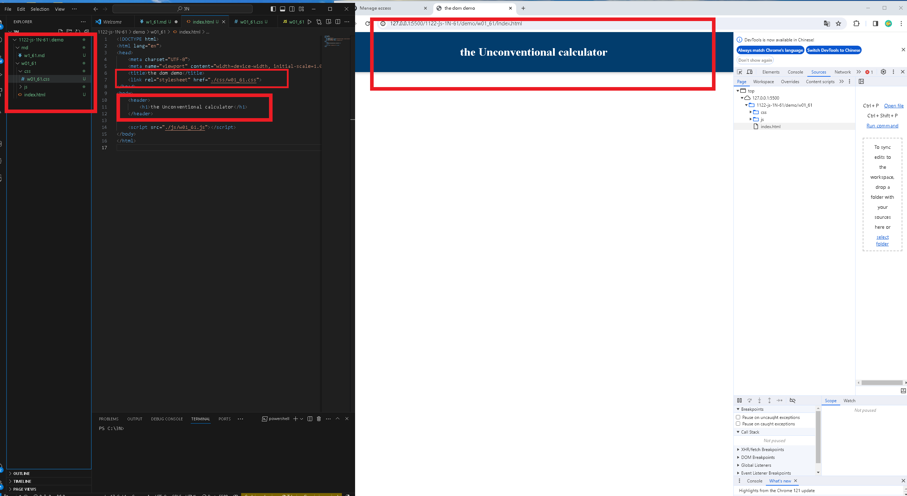
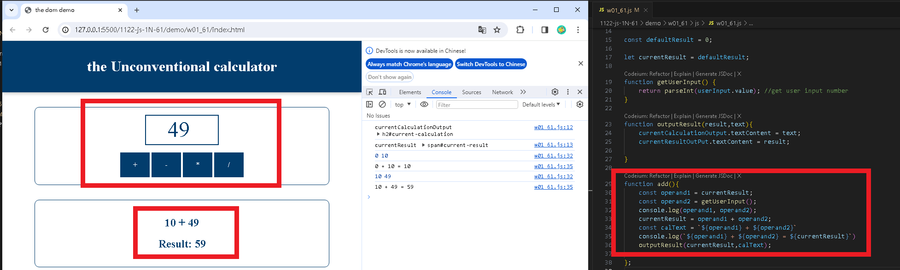
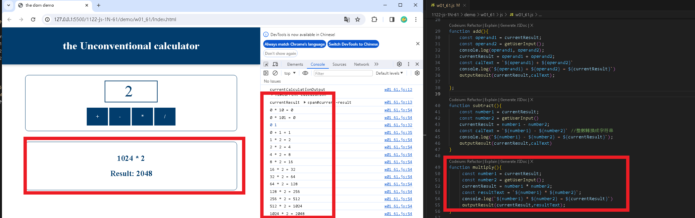

### w01-p1: show the w91-dom title


```

```
### W01-P2: implement add function


### W01-P3: implement subtract function
 

 
### W01-P4: implement multiply function
 

 
### W01-P5: implement divide function
|


### w01-P6: git log
```
a132751 haowei0218      Thu Feb 22 21:50:59 2024 +0800  ### W01-P5: implement divide function
b33a28b haowei0218      Thu Feb 22 19:40:06 2024 +0800  show the w01-dom title
2be732f haowei0218      Thu Feb 22 19:37:20 2024 +0800  show the w01-dom title
01ebefb haowei0218      Thu Feb 22 19:34:59 2024 +0800  show the w01-dom title
a926dd6 haowei0218      Thu Feb 22 19:31:59 2024 +0800  show the w01-dom title
```