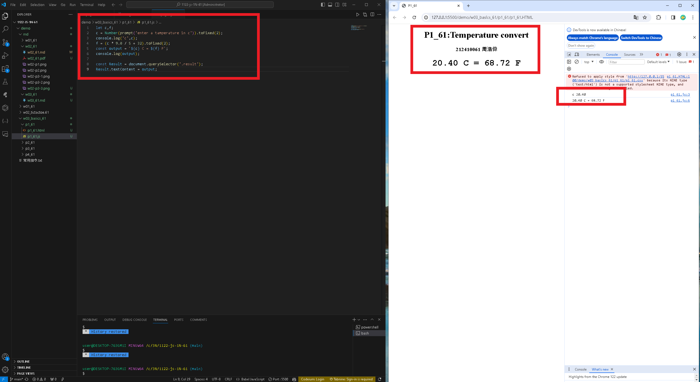

[my github repo URL('https://github.com/haowei212410061/1122-js-1N-61')]
### w03-p1 P1_61 temperature convert


### w03-p2-1: From C to F

```

```

### w03-p2-2: From F to C

```

```


### w03-P3: import sdata and students data from data_xx.js
 


### w03-P4: Compute highest and lowest score of sdata and students2

