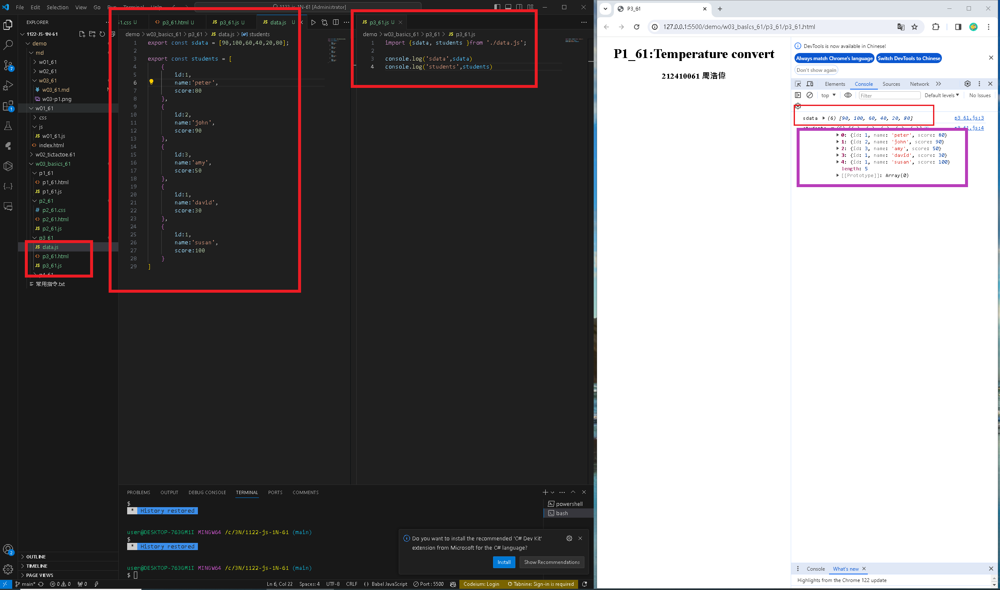
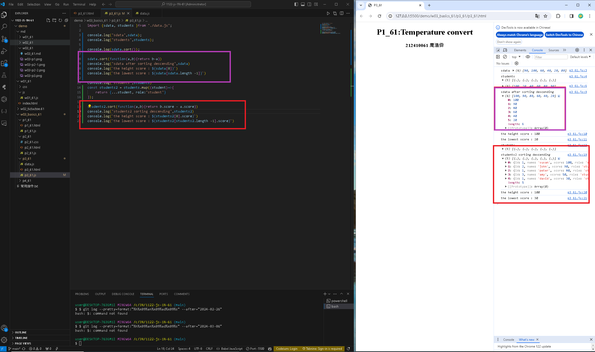

[my github repo URL('https://github.com/haowei212410061/1122-js-1N-61')]
### w03-p1 P1_61 temperature convert


### w03-p2-1: From C to F

```

```

### w03-p2-2: From F to C

```

```


### w03-P3: import sdata and students data from data_xx.js
 


### w03-P4: Compute highest and lowest score of sdata and students2


```
$ git log --pretty=format:"%h%x09%an%x09%ad%x09%s" --after="2024-03-06"
dcdf431 haowei0218      Thu Mar 7 21:51:08 2024 +0900   Compute highest and lowest score of sdata and students2
80dd9b3 haowei0218      Thu Mar 7 21:19:15 2024 +0900   import sdata and students data from data.js
e41a945 haowei0218      Thu Mar 7 21:18:13 2024 +0900   From F to C
e33a9e0 haowei0218      Thu Mar 7 21:17:38 2024 +0900   From C to F
5434e60 haowei0218      Thu Mar 7 20:08:43 2024 +0900   Merge branch 'main' of https://github.com/haowei212410061/1122-js-1N-61
c5227f1 haowei0218      Thu Mar 7 20:08:39 2024 +0900   Temperature convert
```