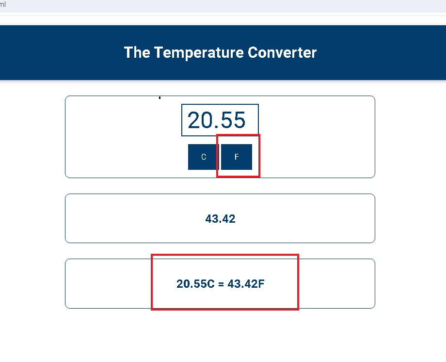
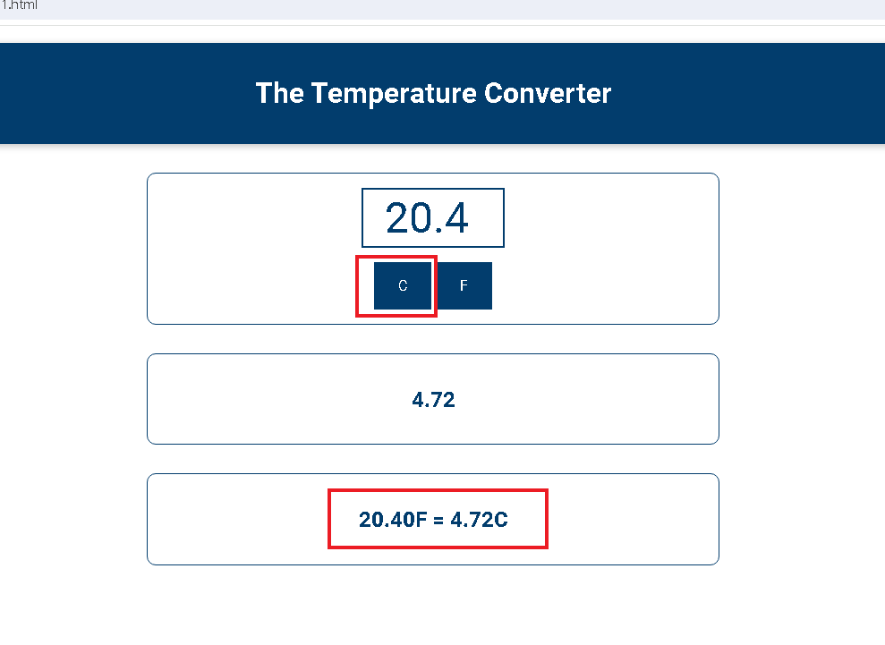

[my github repo URL('https://github.com/haowei212410061/1122-js-1N-61')]

### w03-p2-1: From C to F

```

```

### w03-p2-2: From F to C

```

```


### w03-P3: import sdata and students data from data.js
 


### w03-P3-2: player x win


### w03-P3-3: tie game


### w03-P4: git log
```
$ git log --pretty=format:"%h%x09%an%x09%ad%x09%s" --after="2024-02-28"                                                                                                                                                                                                 
```