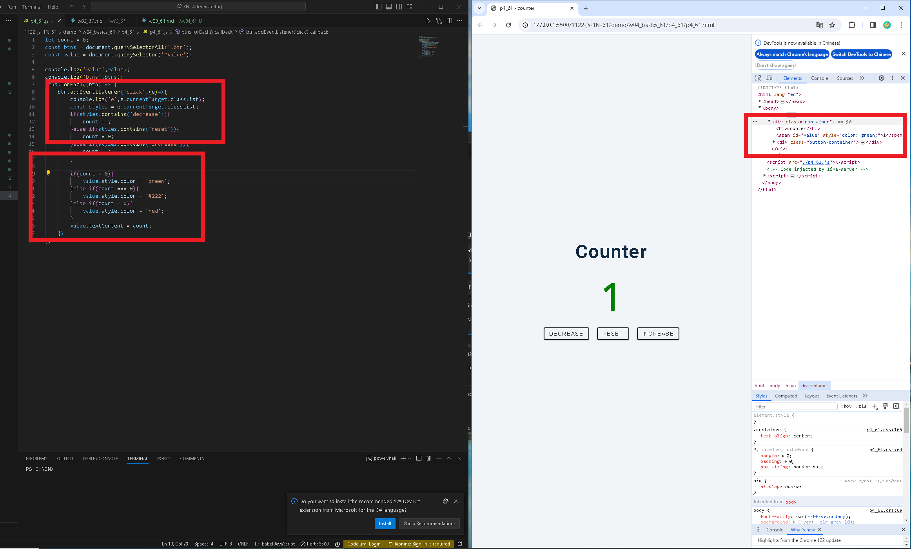
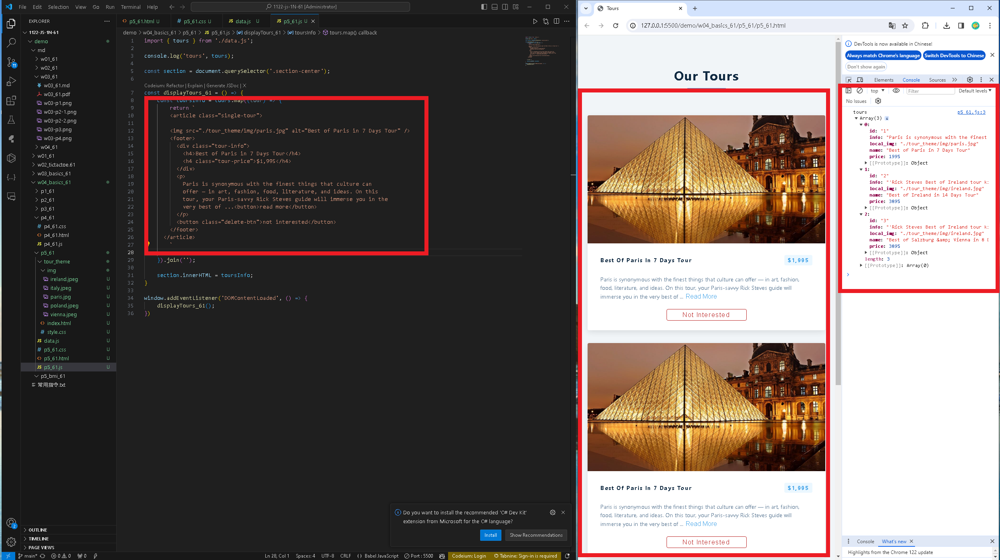
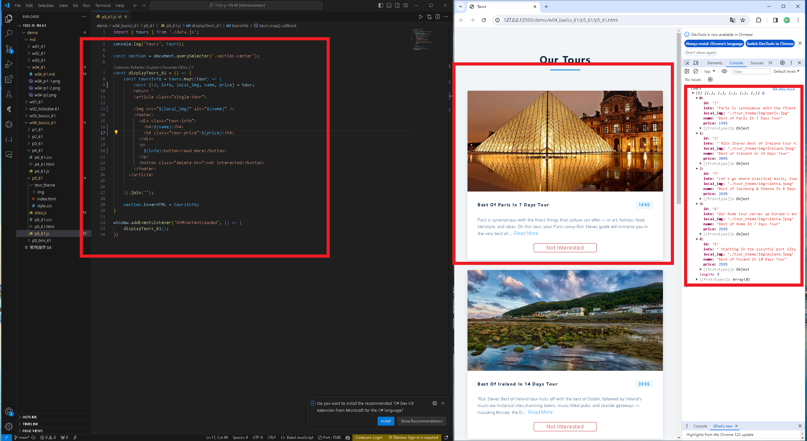
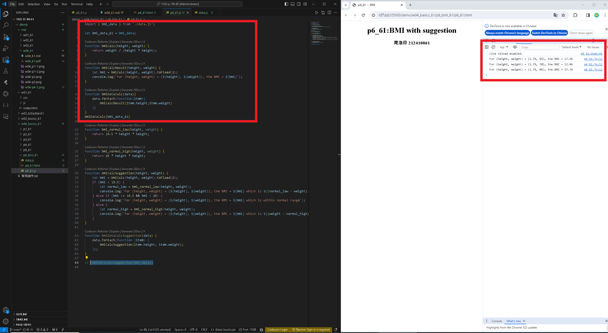
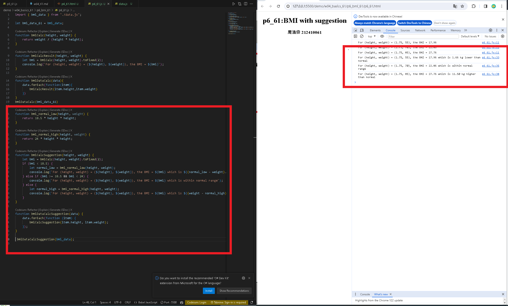

[my github repo URL('https://github.com/haowei212410061/1122-js-1N-61')]
### w04-p1: counter demo



### w04-p2: P5_61 -- Tours display two fixed data
 

```

```

### w04-p3: P5_61 -- Display 5 tours from data_xx.js (json array)

```

```


### w04-P3: import sdata and students data from data_61.js
 


### w04-P4: W04-P4: P6_61 -- BMI Compute with Suggestion

#### => bmiDataCalc(bmi_data_xx);


#### => bmiDataCalcSuggestion(bmi_data_xx);



### w04-p5:git log
```
$ git log --pretty=format:"%h%x09%an%x09%ad%x09%s" --after="2024-03-013"
f1948f3 haowei0218      Thu Mar 14 22:30:50 2024 +0900  W04-P4: P6_61 -- BMI Compute with Suggestion
593b825 haowei0218      Thu Mar 14 21:16:54 2024 +0900  P5_61 -- Display 5 tours from data_xx.js (json array)
48ada92 haowei0218      Thu Mar 14 20:58:36 2024 +0900  P5_61 -- Tours display two fixed data
24215ce haowei0218      Thu Mar 14 20:08:26 2024 +0900  counter demo
```