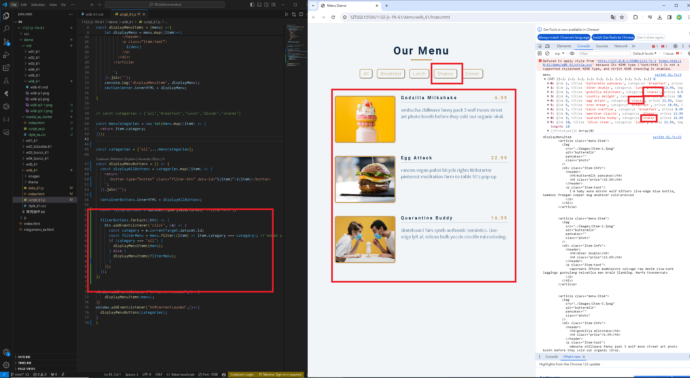

[my github repo URL('https://github.com/haowei212410061/1122-js-1N-61')]
### W06-P1: Create categories dynamically from data_61.js


### w06-P2: Display menu buttons from categories data_61.js
 


### W06-P3: implement filter buttons

#### => choose breakfast
 

 
#### => choose shakes
 

 
#### => choose all
 

 


### W06-P4:implement open modals


### W06-P5: implement close modals


### w06-p6:git log
```

```