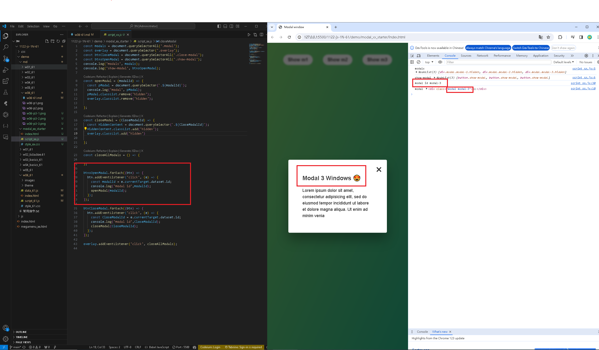
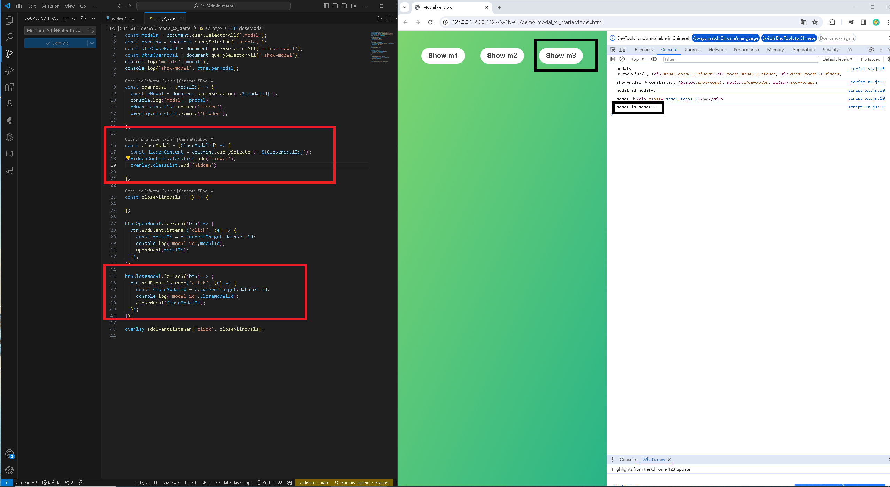

[my github repo URL('https://github.com/haowei212410061/1122-js-1N-61')]
### W06-P1: Create categories dynamically from data_61.js


### w06-P2: Display menu buttons from categories data_61.js
 


### W06-P3: implement filter buttons

#### => choose breakfast
 

 
#### => choose shakes
 

 
#### => choose all
 

 


### W06-P4:implement open modals



### W06-P5: implement close modals



### w06-p6:git log
```
$ git log --pretty=format:"%h%x09%an%x09%ad%x09%s" --after="2024-03-27"                                                                                                                                                                                                 
a5f7cfb haowei0218      Thu Mar 28 23:07:10 2024 +0900  implement close modals
623d2ae haowei0218      Thu Mar 28 23:05:52 2024 +0900  implement open modals
c4e3a82 haowei0218      Thu Mar 28 23:04:34 2024 +0900  implement filter buttons
32593bf haowei0218      Thu Mar 28 21:17:07 2024 +0900  w06-P2: Display menu buttons from categories data_61.js
9573d3c haowei0218      Thu Mar 28 21:01:31 2024 +0900  W06-P1: Create categories dynamically from data_61.js

```