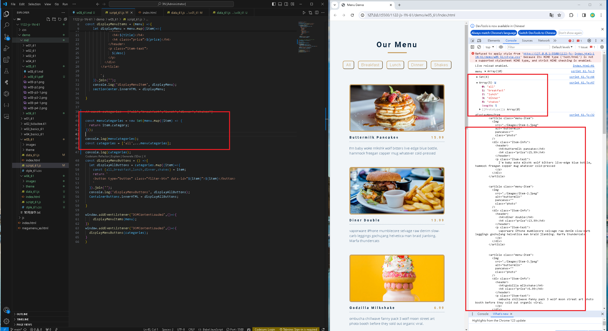
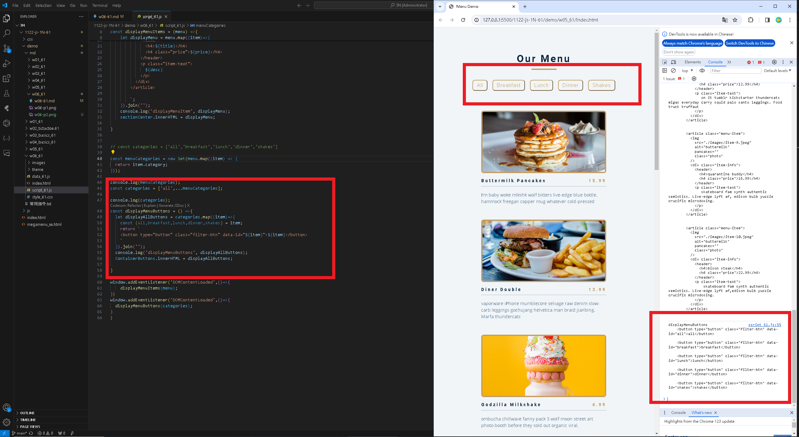
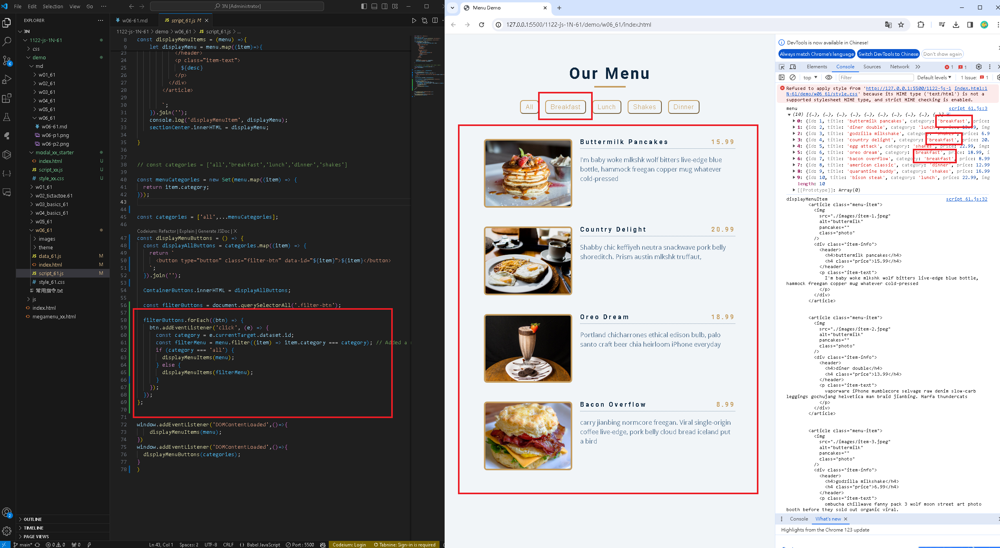
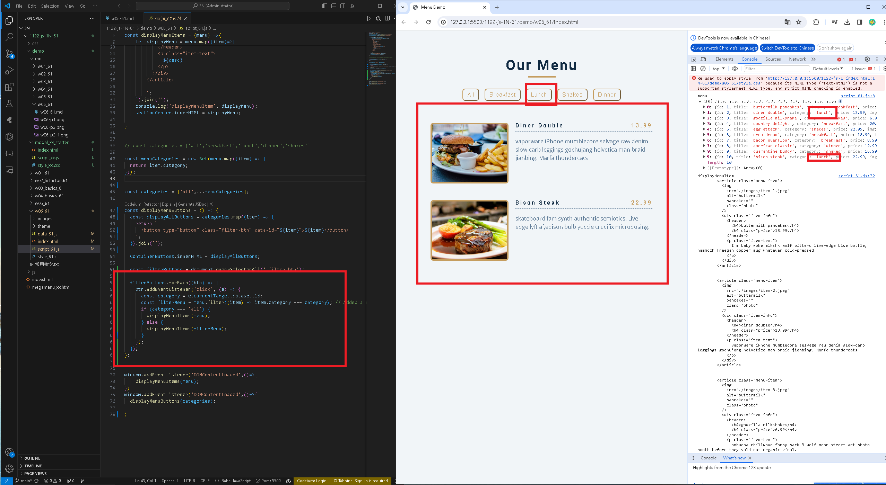

[my github repo URL('https://github.com/haowei212410061/1122-js-1N-61')]
### W06-P1: Create categories dynamically from data_61.js


### w06-P2: 
 

```

```

### w06-p3: 


```

```


### w06-P4: 


### w06-p5:git log
