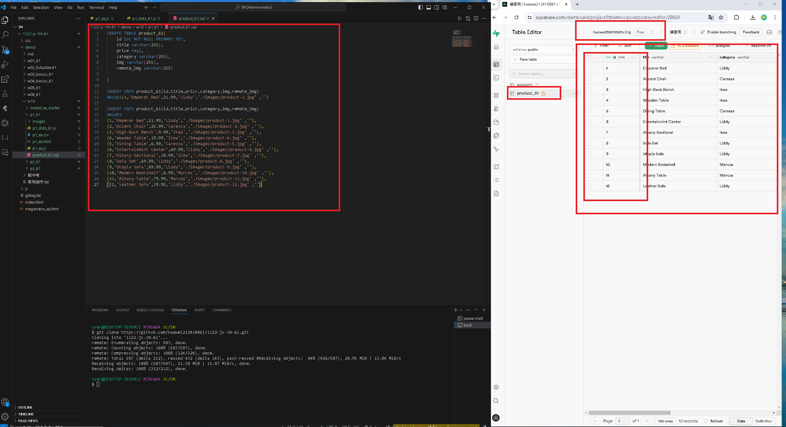

[my github repo URL('https://github.com/haowei212410061/1122-js-1N-61')]
### W10-P1: In Supabase, create product_61 table with 8 product data


### W10-P2: Get a photo from unsplash, and put it into storage in Supabase


### W10-P3: Get 9 products data from Supabase, and show in console


### W10-P4: Show products retrieved from Supabase
 


### w10-p5:git log
```
$ git log --pretty=format:"%h%x09%an%x09%ad%x09%s" --after="2024-04-24"                                                                                                                                                                                                 
06ae6c1 haowei0218      Thu Apr 25 21:53:11 2024 +0900  W10-P4: Show products retrieved from Supabase
3107ddf haowei0218      Thu Apr 25 21:28:15 2024 +0900  W10-P3: Get 9 products data from Supabase, and show in console        
77c3568 haowei0218      Thu Apr 25 20:44:28 2024 +0900  W10-P2: Get a photo from unsplash, and put it into storage in Supabase
de32093 haowei0218      Thu Apr 25 20:12:29 2024 +0900  W10-P1: In Supabase, create product_61 table with 8 product data    

```
