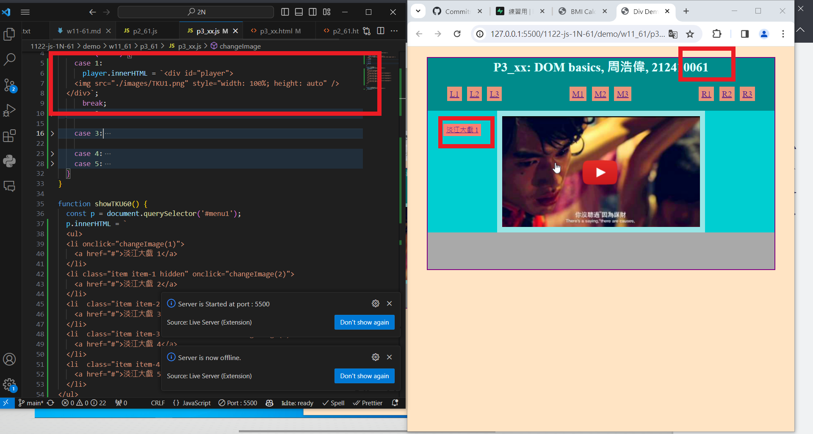
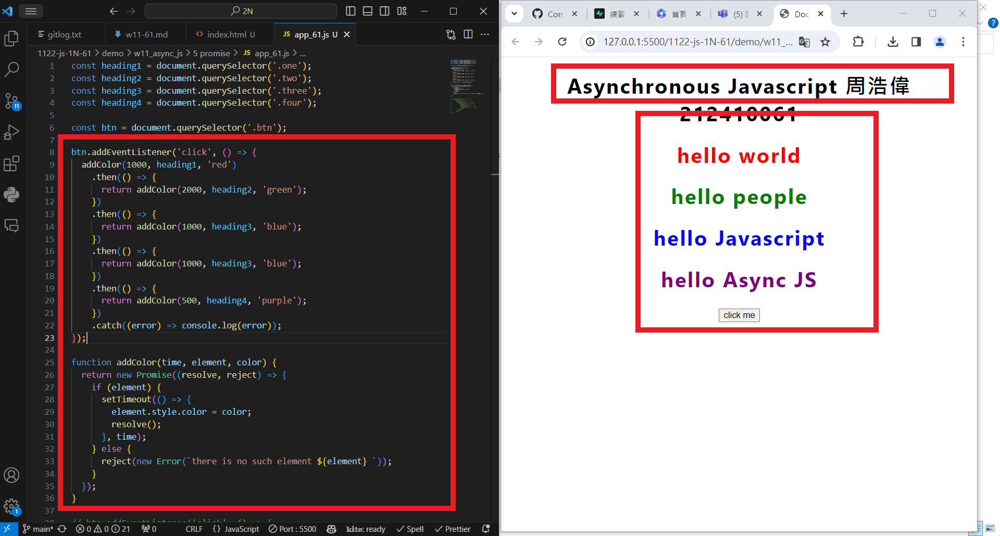
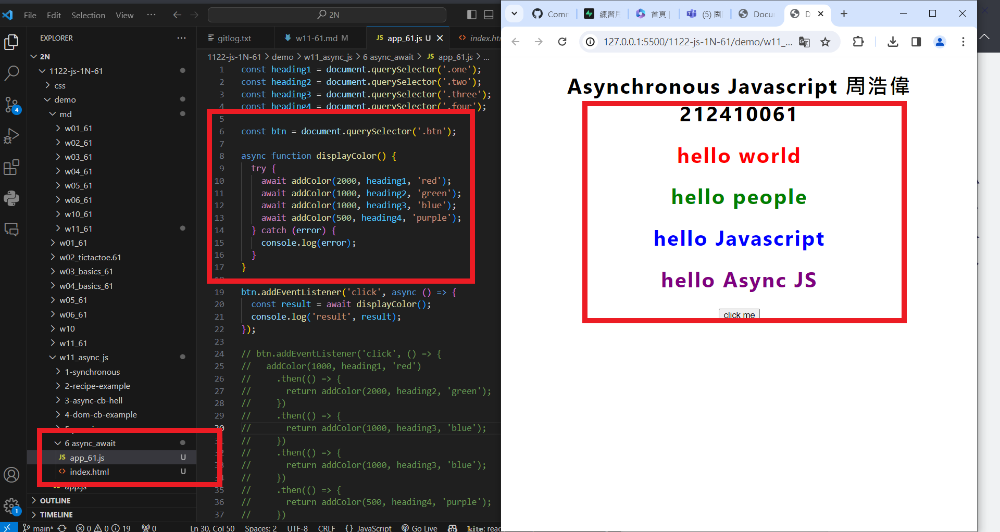

[my github repo URL('https://github.com/haowei212410061/1122-js-1N-61')]

### w11-P1: answer p2_61 in mid21


### w11-P2: answer p3_61 in mid21



### w11-P3: answer for '5-promise-demo'



### w11-P4: answer for '6- await async_js'



### w11-p5:git log

```
$ git log --pretty=format:"%h%x09%an%x09%ad%x09%s" --after="2024-04-24"


```
