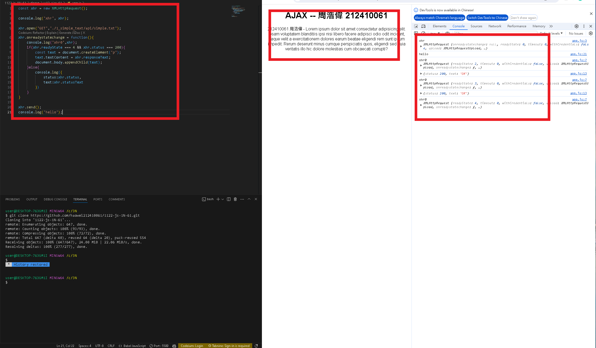
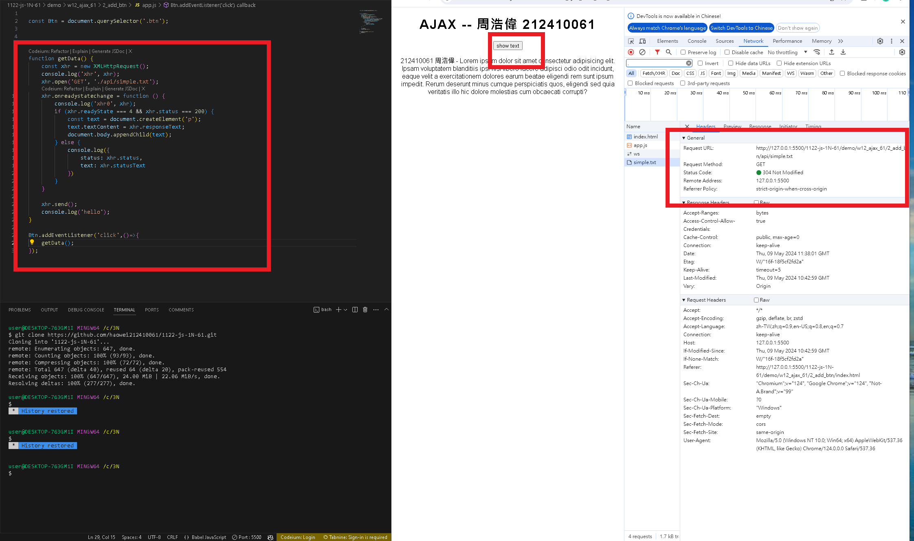
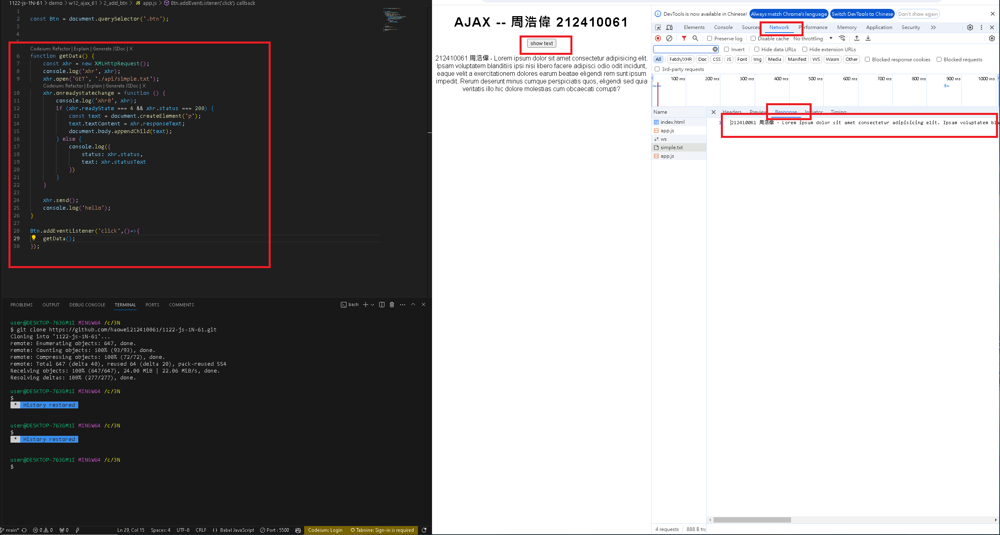
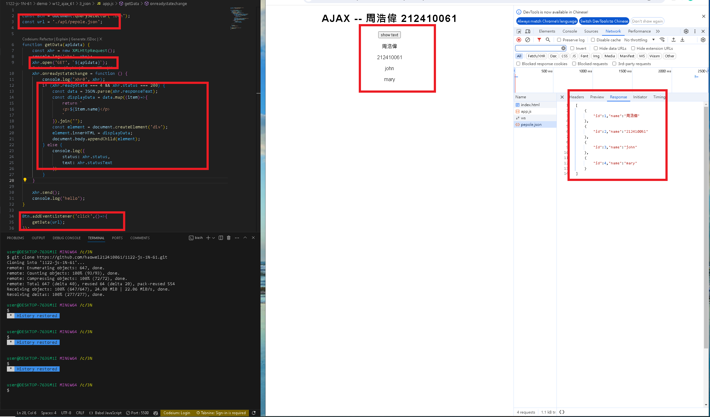

[my github repo URL('https://github.com/haowei212410061/1122-js-1N-61')]

### w12-P1: Do 1_simple-text



### w12-P2: Do 2_add_btn





### w12-P3: answer for '5-promise-demo'



### w12-P4: answer for '6- await async_js'


### w12-p5:git log

```


```
