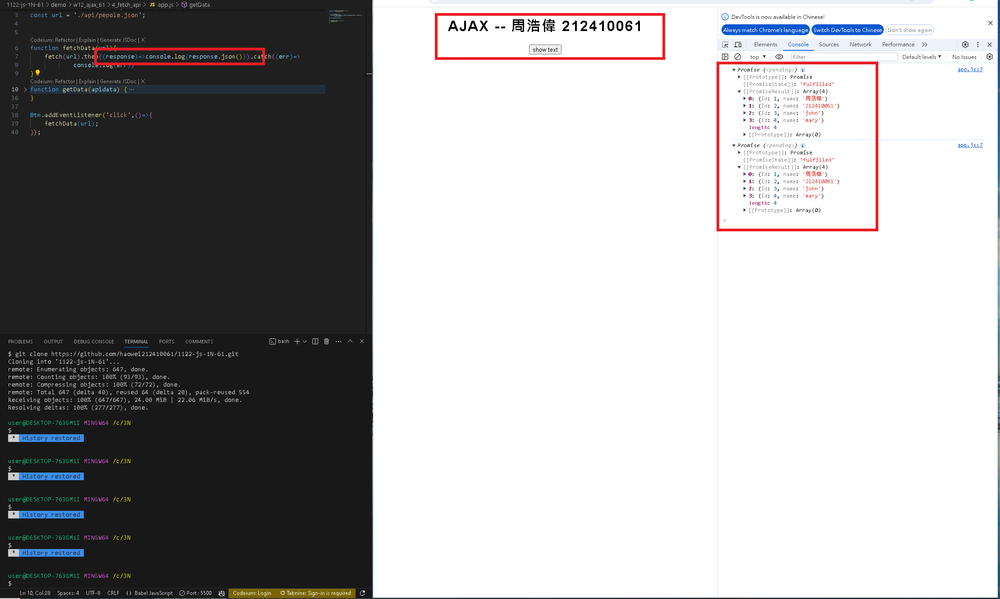

[my github repo URL('https://github.com/haowei212410061/1122-js-1N-61')]

### w12-P1: Do 1_simple-text


### w12-P2: Do 2_add_btn


### w12-P3:  Do 3_json_data


### w12-P4-1:fetch(url).then(response => response.json())



### w12-P4-2:fetch api vs xhr


### w12-p5:Do 5_json_people_async_await


### w12-p6:git log

```

$ git log --pretty=format:"%h%x09%an%x09%ad%x09%s" --after="2024-05-08"
239452c haowei0218      Thu May 9 20:46:46 2024 +0800   w12-P4-1:fetch(url).then(response => response.json())
cc5a02c haowei0218      Thu May 9 20:45:57 2024 +0800   w12-P4:fetch(url).then(response => response.json())
061c6d1 haowei0218      Thu May 9 20:18:04 2024 +0800   w12-P3:  Do 3_json_data
de30168 haowei0218      Thu May 9 19:44:07 2024 +0800   w12-P2: Do 2_add_btn
cb2e6e7 haowei0218      Thu May 9 19:16:46 2024 +0800   w12-P1: Do 1_simple-text

```
