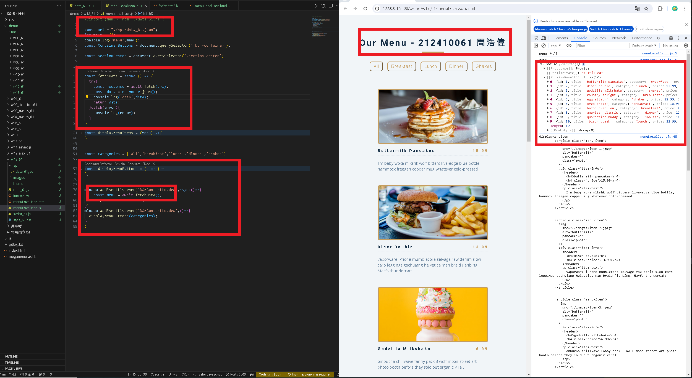
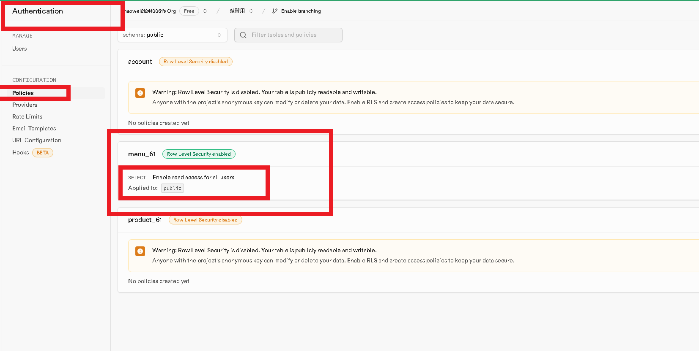
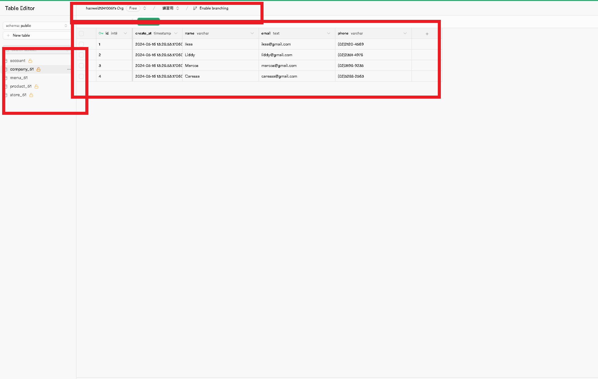
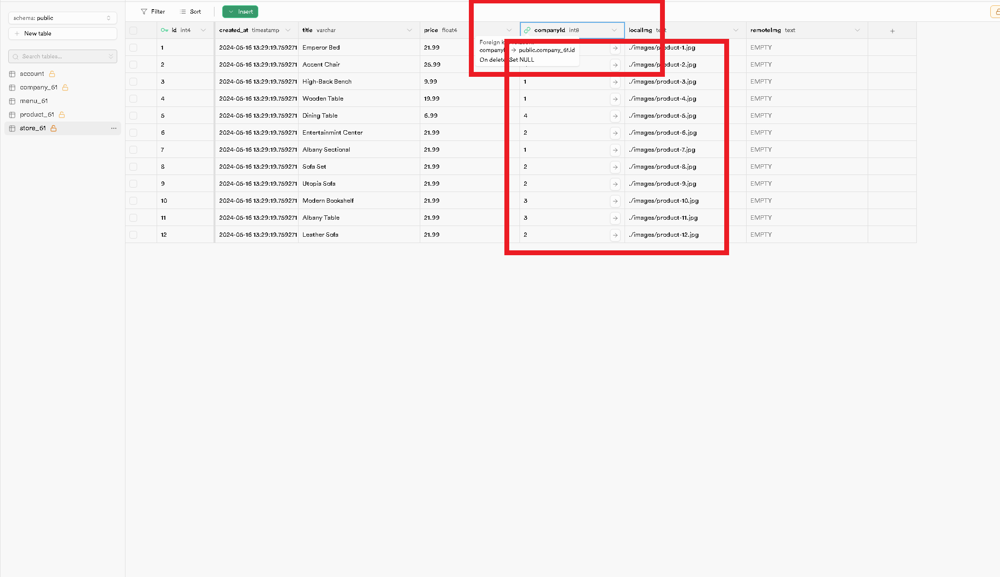

[my github repo URL('https://github.com/haowei212410061/1122-js-1N-61')]

### w13-P1: Get 3 menu data from /api/data_61.json



### w13-P2: Do 2_add_btn




### w13-P3:  Do 3_json_data


### w13-P4-1:fetch(url).then(response => response.json())



### w13-P4-2:fetch api vs xhr


### w13-p5:Do 5_json_people_async_await


### w13-p6:git log

```


```
