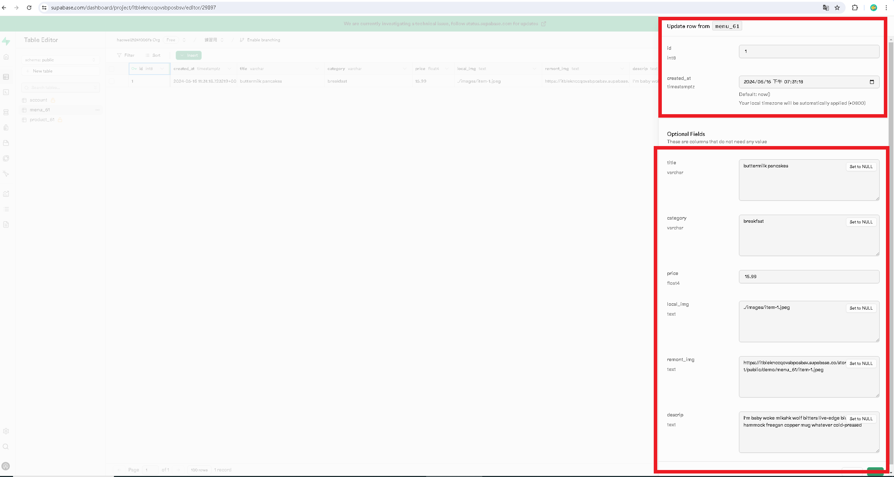

[my github repo URL('https://github.com/haowei212410061/1122-js-1N-61')]

### w13-P1: Get 3 menu data from /api/data_61.json


### W13-P2: Create 3 menu data from Supabase

#### => create menu_61 table, and add 1 menu data
 

 
#### => add RLS read policy for public access
 

 
#### => add two more menu data from SQL command
 

 
#### => show 3 menu data from menu_61 table
 

 

### w13-P3: Use menuSuap.html , menuSuap.js to get 3 menu data from supabase


### W13-P4: Create company_61 and store_61 tables, and insert all data


### w13-p5:git log

```
$ git log --pretty=format:"%h%x09%an%x09%ad%x09%s" --after="2024-05-15"
ec04ae8 haowei0218      Thu May 16 20:33:27 2024 +0800  w13-P3: Use menuSuap.html , menuSuap.js to get 3 menu data from supabase
22b7306 haowei0218      Thu May 16 20:00:18 2024 +0800  Create 3 menu data from Supabase
39a3449 haowei0218      Thu May 16 19:09:19 2024 +0800  w13-P1: Get 3 menu data from /api/data_61.json

```
