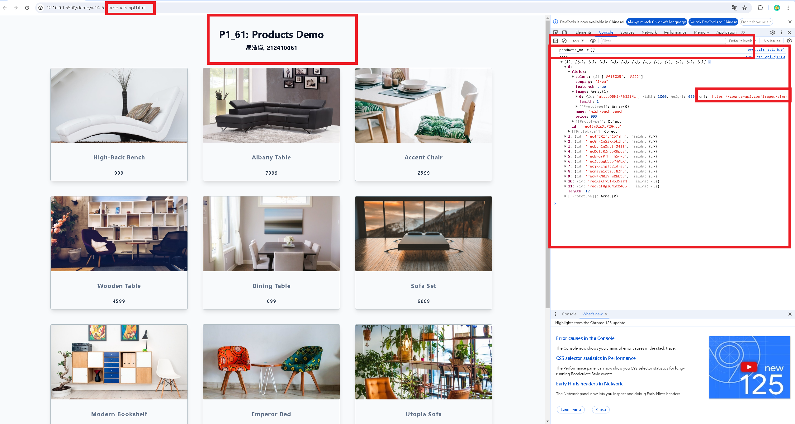
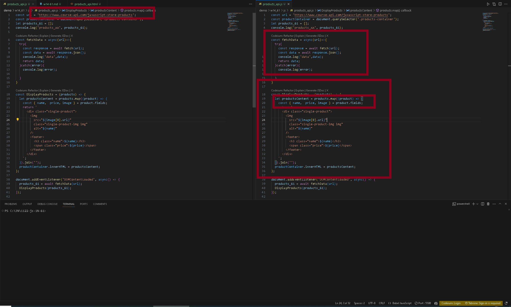
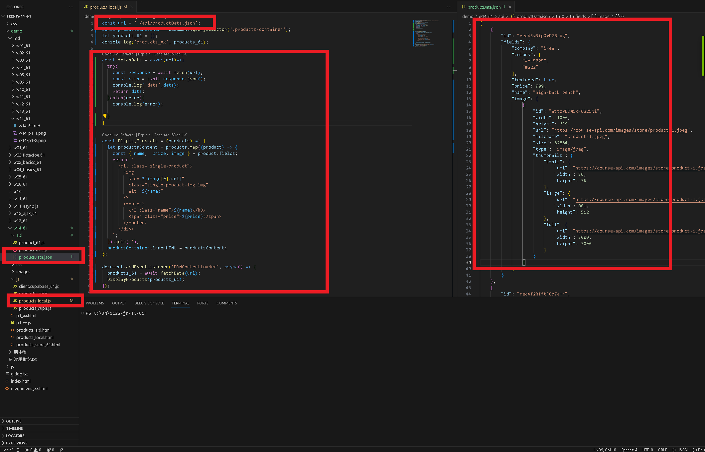
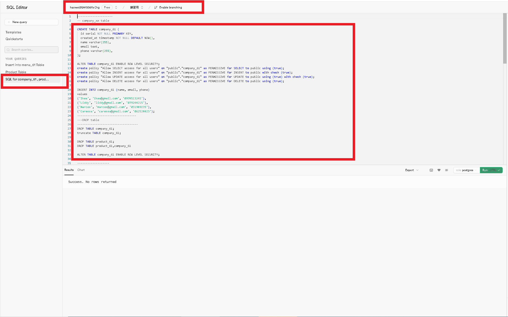
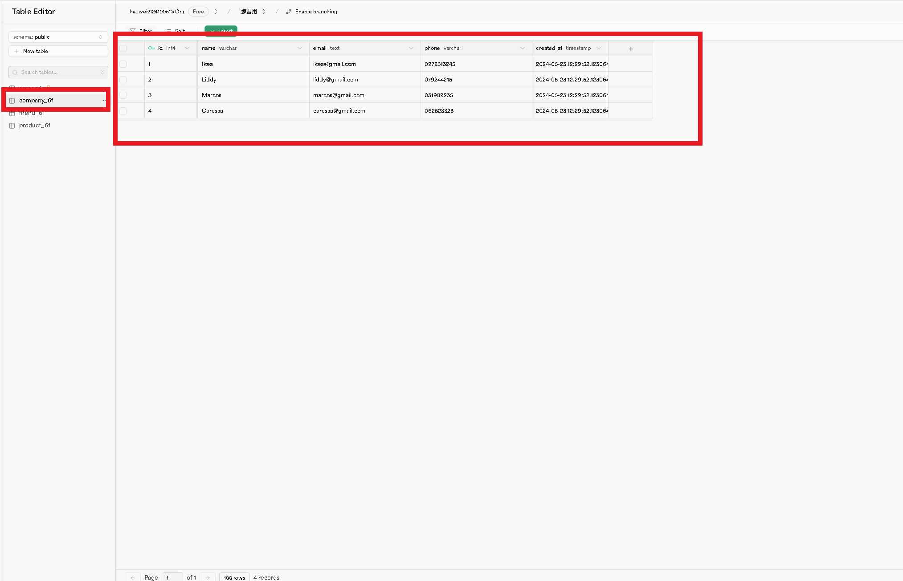

[my github repo URL('https://github.com/haowei212410061/1122-js-1N-61')]

### w14-P1: Do products_api_61.js to get data from an api url 




### w14-P2: Do products_local_61.js to get local json data (/api/productData.json) 



### w14-P3: Use menuSuap.html , menuSuap.js to get 3 menu data from supabase




### w14-P4: Create company_61 and store_61 tables, and insert all data


### w14-p5:git log

```


```
