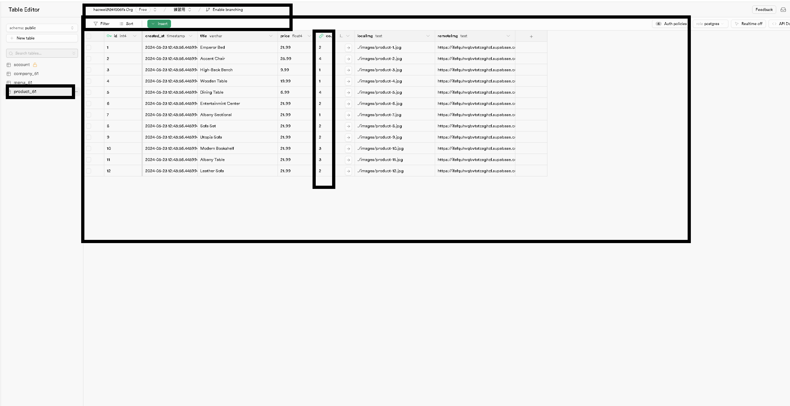
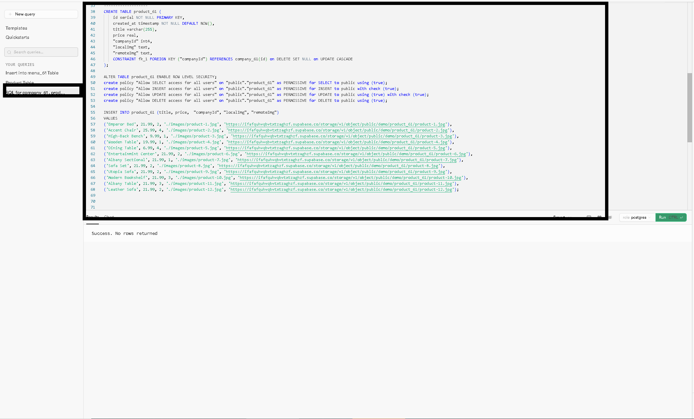
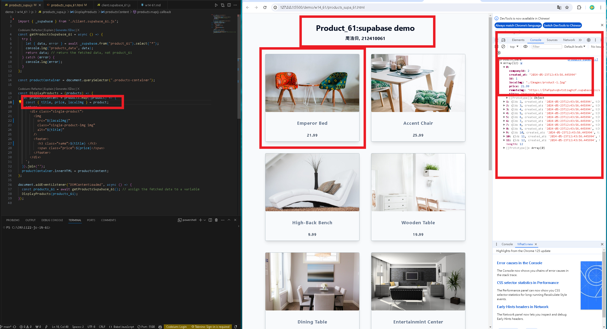

[my github repo URL('https://github.com/haowei212410061/1122-js-1N-61')]

### w14-P1: Do products_api_61.js to get data from an api url 


### w14-P2: Do products_local_61.js to get local json data (/api/productData.json) 


### W14-P3: Use SQL to create schemas and data for company_61 and products_61
 
#### => company_61 schema and data
 

 

 
#### => products_61 schema and data
 

 

 

### W14-P4: Do products_supa_61.js to get data from Supabase
 




### w14-p5:git log

```
$ git log --pretty=format:"%h%x09%an%x09%ad%x09%s" --after="2024-05-22"
0104d70 haowei0218      Thu May 23 21:09:54 2024 +0800  W14-P4: Do products_supa_61.js to get data from Supabase
38d7d63 haowei0218      Thu May 23 20:49:32 2024 +0800  W14-P3: Use SQL to create schemas and data for company_61 and products_61
6126194 haowei0218      Thu May 23 19:45:12 2024 +0800  w14-P2: Do products_local_61.js to get local json data (/api/productData.json)
1fdc55b haowei0218      Thu May 23 19:15:47 2024 +0800  w14-P1: Do products_api_61.js to get data from an api url

```
