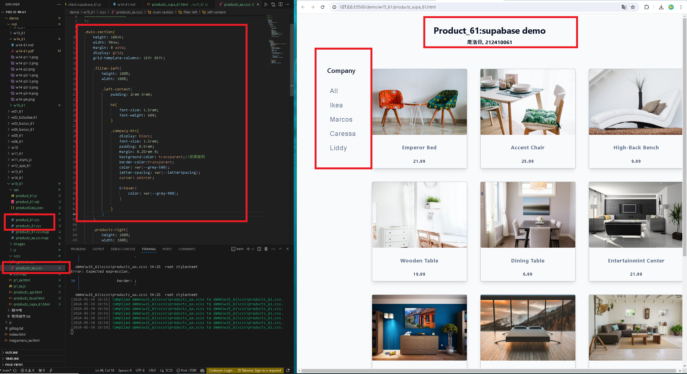
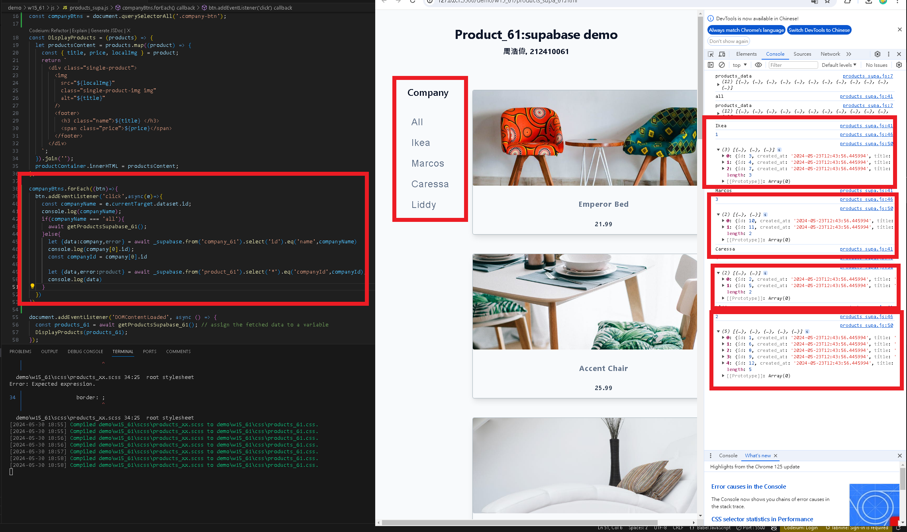
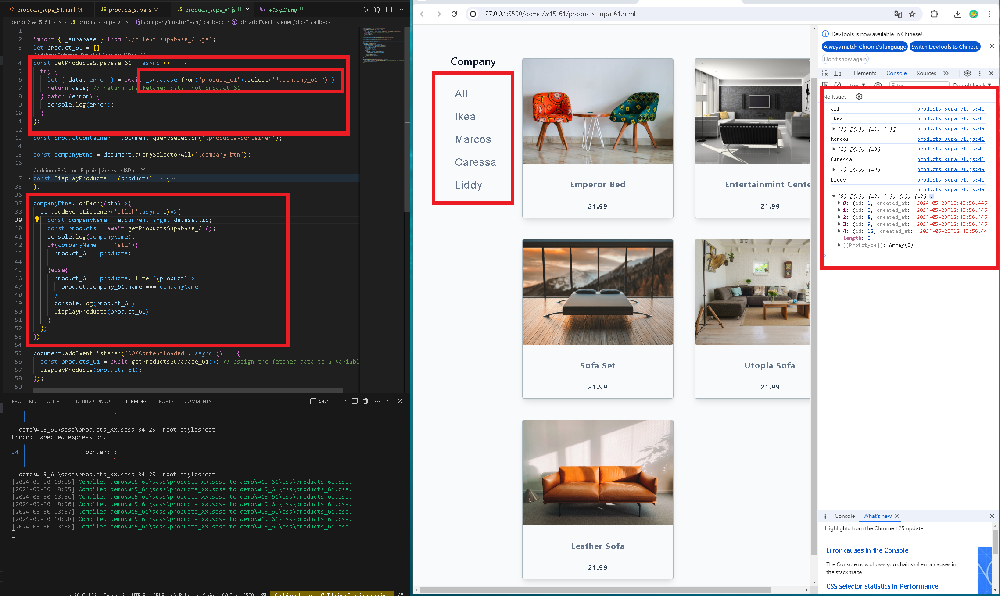
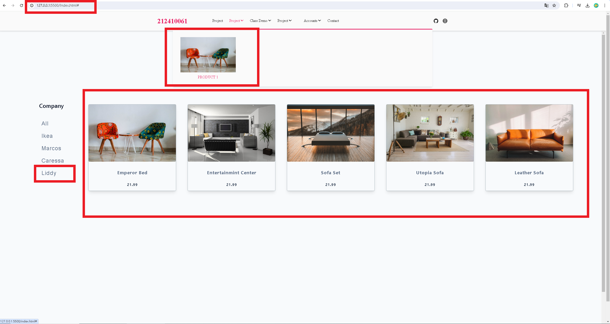
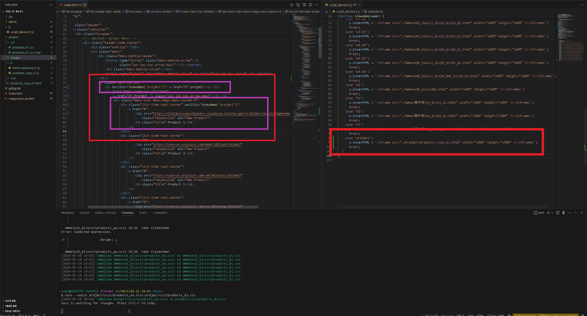
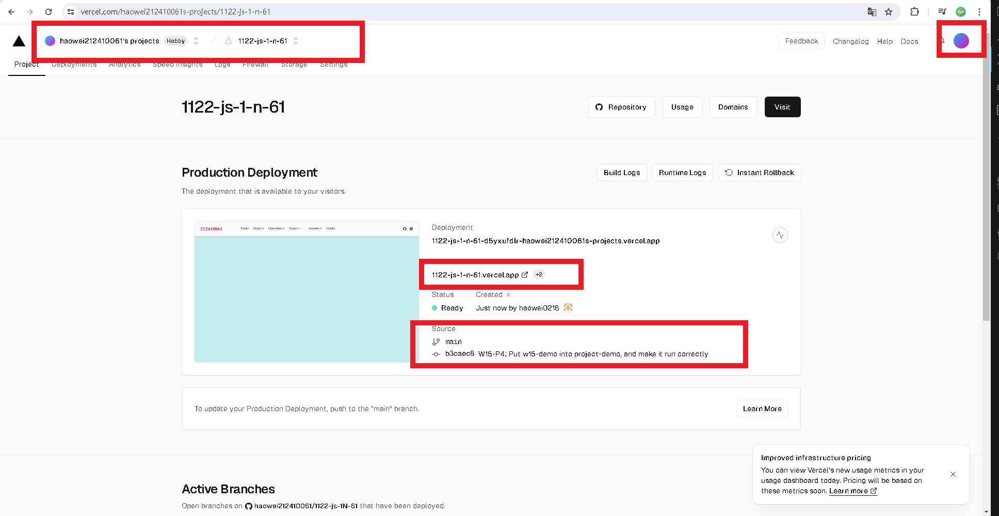
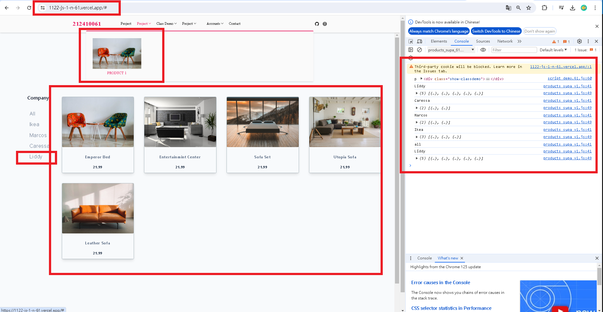

[my github repo URL('https://github.com/haowei212410061/1122-js-1N-61')]

### w15-P1: Create company (filter) menu using scss 




### w15-P2: Do products_local_61.js to get local json data (/api/productData.json) 



### W15-P3: Implement company filter function s. test foreach company using filtering of the products containing company data
 




### W15-P4: Put w15-demo into project-demo, and make it run correctly
 
#### local





#### vercel



### w15-p5:git log

```
$ git log --pretty=format:"%h%x09%an%x09%ad%x09%s" --after="2024-05-29"
fefaa05 haowei0218      Thu May 30 21:40:49 2024 +0800  local
e0143a2 haowei0218      Thu May 30 21:34:46 2024 +0800  ### W15-P4: Put w15-demo into project-demo, and make it run correctly
b3caec8 haowei0218      Thu May 30 21:23:04 2024 +0800  W15-P4: Put w15-demo into project-demo, and make it run correctly
92d6f69 haowei0218      Thu May 30 20:37:58 2024 +0800  W15-P3: Implement company filter function s. test foreach company using filtering of the products containing company data
0f88c40 haowei0218      Thu May 30 20:37:33 2024 +0800  W15-P3: Implement company filter function s. test foreach company using filtering of the products containing company data
8096d8e haowei0218      Thu May 30 20:36:55 2024 +0800  ### W14-P3: Implement company filter function s. test foreach company using filtering of the products containing company data
f6fbbcd haowei0218      Thu May 30 19:07:17 2024 +0800  w15-P1: Create company (filter) menu using scss


```
