[my github repo URL('https://github.com/haowei212410061/1122-js-1N-61')]

[My Vercel Homepage('https://1122-js-1-n-61.vercel.app/')]

## API Project 簡要說明

### 簡易的圖書管理系統 可以針對資料進行操作

### 重點 1:新增資料功能

### 重點 2:查詢資料功能
#### 利用後端api對資料庫進行不同的搜尋

### 重點 3:編輯資料功能

### 重點 4:刪除資料功能

### 重點 5:資料庫關聯表

---

## API 資料及網路資源來源說明

### Api 資料 ： 後端api路由對資料庫CRUD

### 網路資源來源 1 : Loading動畫設計參考資料:https://www.w3schools.com/howto/howto_css_loader.asp

---

## 後端 Supabase 資料庫設計

### SQL schema and data

#### => table 1 : 書籍的資料（書本編號,書本名稱,作者,書籍分類）

#### => table 2 : 書籍的借閱紀錄(借閱編號,書籍編號,使用者,借閱狀態(是否歸還書籍) ,借閱日期)

#### => 提供執行一次就可重新建立 schema 及 data 之 SQL 指令

```
CREATE TABLE BooksData (
  book_id varchar(50) PRIMARY KEY,
  book_name varchar(50),
  author_name varchar(50),
  classification varchar(50)
);


CREATE TABLE BorrowRecord (
  record_id varchar(50) PRIMARY KEY,
  id char(255),
  user_id VARCHAR(255),
  borrow_status VARCHAR(50),
  borrow_date text,
  FOREIGN KEY (id) REFERENCES booksdata(book_id)
);

INSERT INTO booksdata (book_id, book_name, author_name, classification)
VALUES ('160', '1New Book Title', '1Author Name','恐怖');

INSERT INTO borrowrecord(record_id,id,user_id,borrow_status,borrow_date)
VALUES(
  '789456',
  '160',
  'User5050',
  'successful',
  '5/29/2024, 12:12:42 PM'
)
```

---

### 前端程式設計說明

#### => 功能 1:查詢

##### 查詢書籍的名稱:對一個搜尋的api發起一個get請求 該api會在資料庫的name欄位查詢指定的書籍名稱

#### 前端code
```
/**
 * 目前有兩種搜尋功能
 * 1. 選單內容：書籍編號 書籍作者 書籍名稱 再由右側輸入匡輸入內容
 * 2. 根據書籍分類選單的內容查詢
 * 因為目前只能做到單一查詢
 * 所以為了讓搜尋按鈕區分目前要執行的是哪種搜尋
 * 因此進行以下判斷
 * 1. 若第一種查詢功能的右側輸入匡value為空字串 則代表現在要查詢的是書籍分類
 * 2. 若第一種查詢功能的右側輸入匡value不為空字串 則不使用書籍分類查詢
 */
search_btn.addEventListener("click", async () => {
  const Filter_input = FilterInput.value.trim();
  if (Filter_input === "") {
    let result = SelectOptionValue();
    const response = await FetchApi(
      `http://localhost:3000/api/classification/${result}`,
      "GET"
    );
    PerpageDisplayData(1, response);
    itempage += 1;
  } else {
    SelectInfoValue();
  }

```
#### 後端code
##### 說明:req.params會解析出url內的column以及searchdata 再將這兩個變數 放在eq()內進行查詢
```
app.get("/api/:column/:searchdata", async (req, res) => {
  try {
    const { column, searchdata } = req.params;
    const { data, error } = await supabase
      .from("booksdata")
      .select("*")
      .eq(column, searchdata);
    res.json(data);
  } catch (error) {
    console.log(error);
    res.status(500);
  }
});


```

###### before

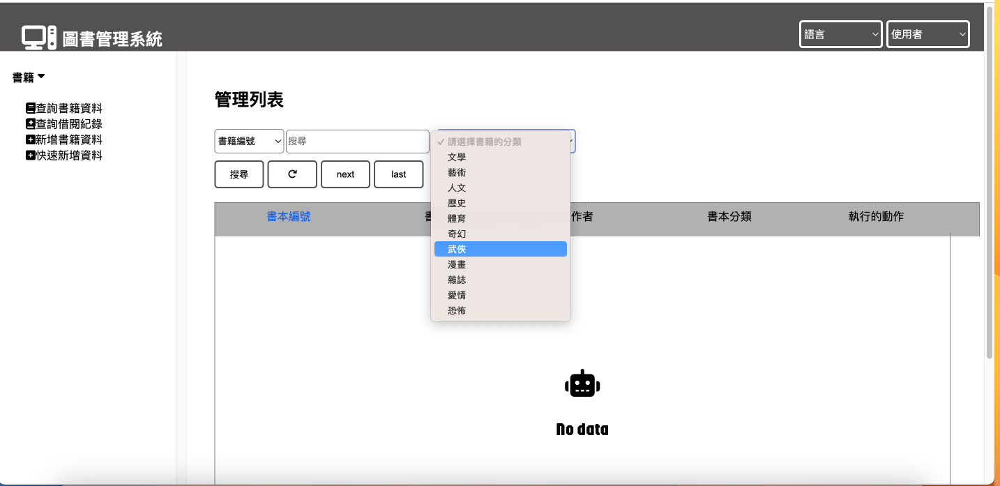

###### after

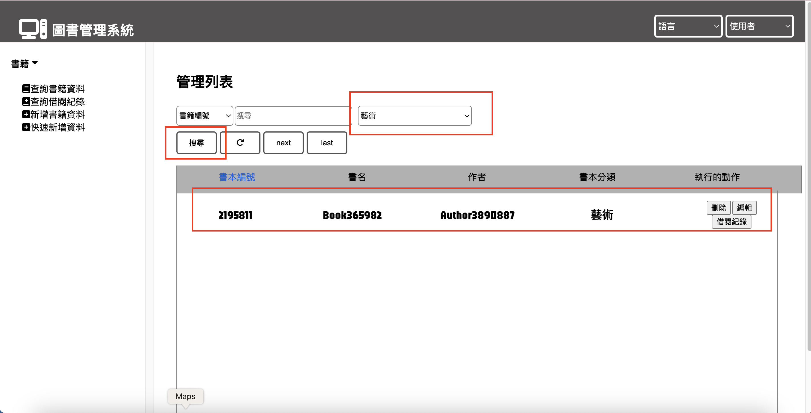

##### 查詢書籍的編號:對一個搜尋的api發起一個get請求 該api會在資料庫的book_id欄位查詢指定的書籍編號
###### 說明:後端一樣是利用下方的API進行查詢 欄位以及資料都是動態的 
```
app.get("/api/:column/:searchdata", async (req, res) => {
  try {
    const { column, searchdata } = req.params;
    const { data, error } = await supabase
      .from("booksdata")
      .select("*")
      .eq(column, searchdata);
    res.json(data);
  } catch (error) {
    console.log(error);
    res.status(500);
  }
});


```
###### before

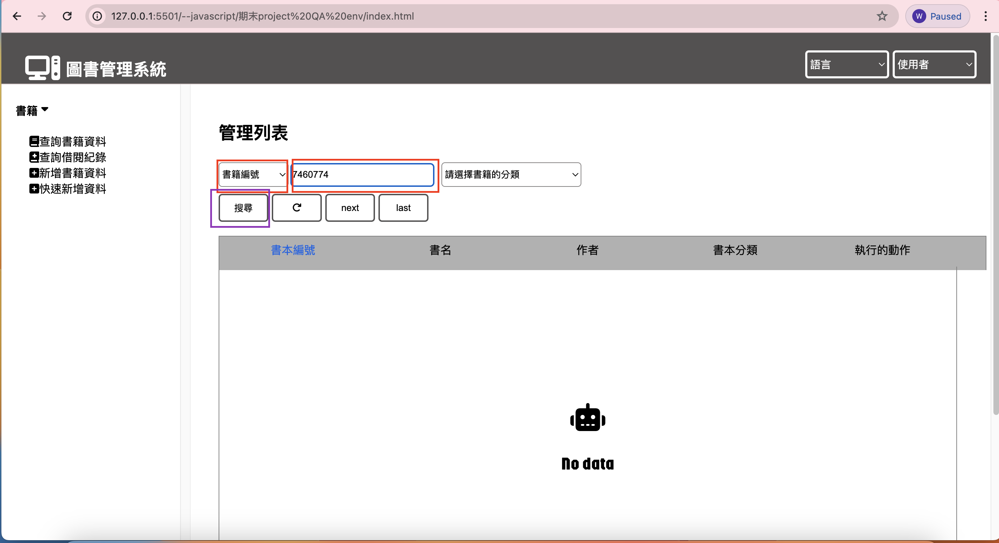

###### after

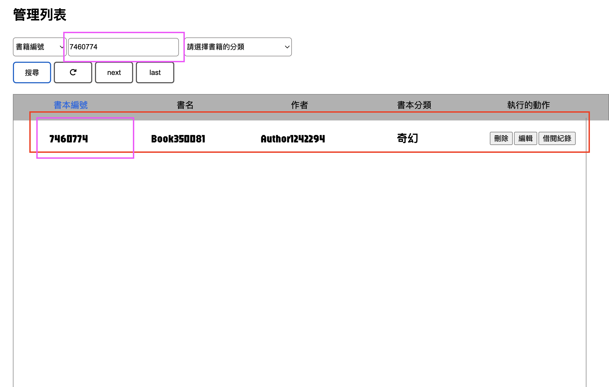

##### 查詢指定的書籍分類
##### 查詢書籍的分類:對一個搜尋的api發起一個get請求 該api會在資料庫的classification欄位查詢指定的書籍分類
###### 說明:後端一樣是利用下方的API進行查詢 欄位以及資料都是動態的 
```
app.get("/api/:column/:searchdata", async (req, res) => {
  try {
    const { column, searchdata } = req.params;
    const { data, error } = await supabase
      .from("booksdata")
      .select("*")
      .eq(column, searchdata);
    res.json(data);
  } catch (error) {
    console.log(error);
    res.status(500);
  }
});


```

###### before

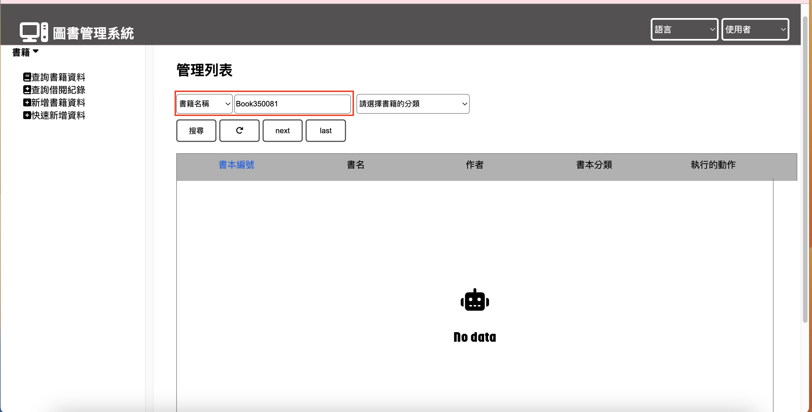

###### after

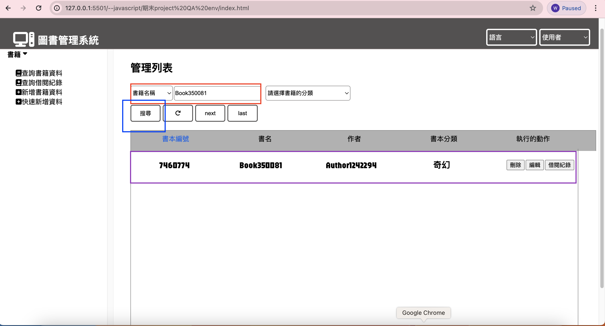

##### 查詢指定的書籍作者
##### 查詢書籍的作者:對一個搜尋的api發起一個get請求 該api會在資料庫的author_name欄位查詢指定的書籍作者
###### 說明:後端一樣是利用下方的API進行查詢 欄位以及資料都是動態的 
```
app.get("/api/:column/:searchdata", async (req, res) => {
  try {
    const { column, searchdata } = req.params;
    const { data, error } = await supabase
      .from("booksdata")
      .select("*")
      .eq(column, searchdata);
    res.json(data);
  } catch (error) {
    console.log(error);
    res.status(500);
  }
});


```

###### before

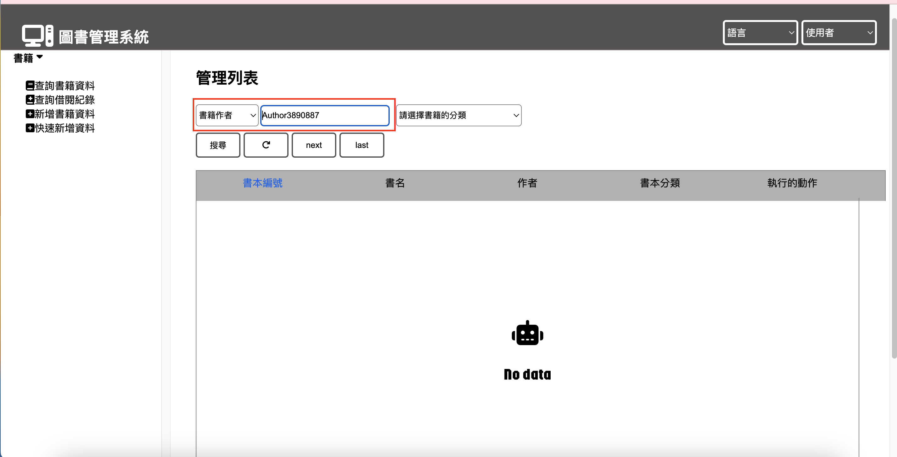

###### after

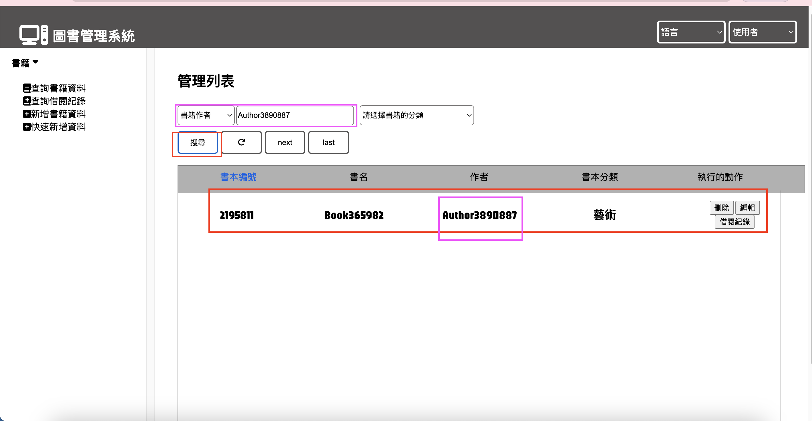

##### 查詢指定書籍的借閱紀錄
##### 查詢指定書籍的借閱紀錄:對一個搜尋借閱紀錄的api發起一個get請求 該api會在資料庫的borrowRecord表的id欄位查詢指定書籍的借閱紀錄 
##### 因為這兩張表有關聯 且booksdata table book_id = primary key 且等於 borrowRecord table foreign 因此只要用book_id搜尋就可以找到另一張表的借閱紀錄

```
app.get("/api/v2/borrowRecord/book_id=:bookId", async (req, res) => {
  try {
    const book_Id = req.params.bookId;
    const { data, error } = await supabase
      .from("borrowrecord")
      .select(
        `record_id, user_id, borrow_status, borrow_date ,booksdata(book_id)`
      )
      .eq("id", book_Id);
    console.log(data);
    res.json(data);
  } catch (error) {
    res.status(500).json({ error });
  }
});
```

###### before

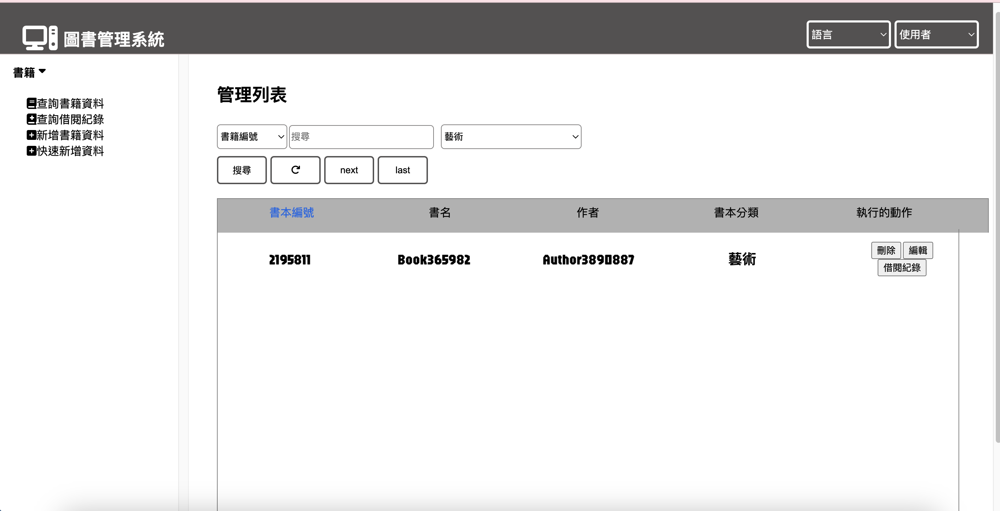

###### after

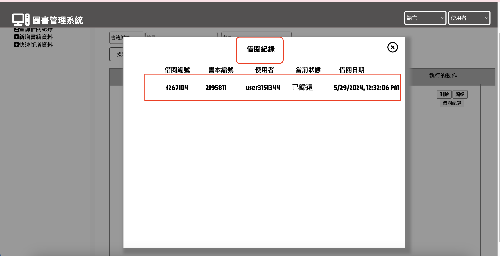

##### 查詢指定使用者的借閱紀錄
##### 查詢指定使用者的借閱紀錄:對一個搜尋的api發起一個get請求 該api會在資料庫borrowRecord table的user_id欄位查詢指定的使用者
###### 說明:後端一樣是利用下方的API進行查詢 欄位以及資料都是動態的 
```
app.get("/api/v3/borrowReocrd/:column/:result", async (req, res) => {
  try {
    const { column, result } = req.params;
    const { data } = await supabase
      .from("borrowrecord")
      .select("*")
      .eq(column, result);
    res.json(data);
  } catch (error) {
    console.log(error);
    res.status(500);
  }
});

```

###### before

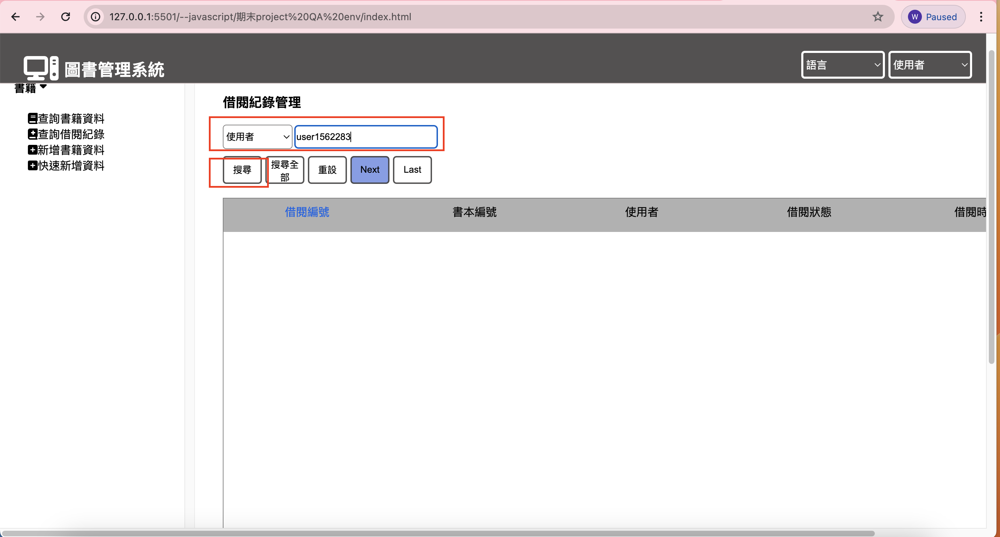

###### after

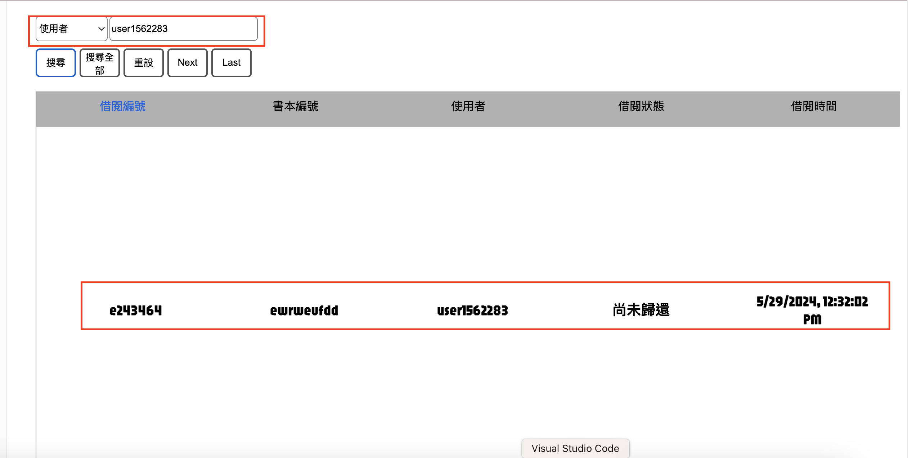

##### 查詢指定借閱狀態下的所有書籍
###### 說明:前端在輸入框抓到指定的借閱狀態後 
###### 後端對一個查詢api發起get請求 該api會在borrowRecord的borrow_status欄位查詢借閱狀態是已歸還或是尚未歸還的所有資料 

###### before

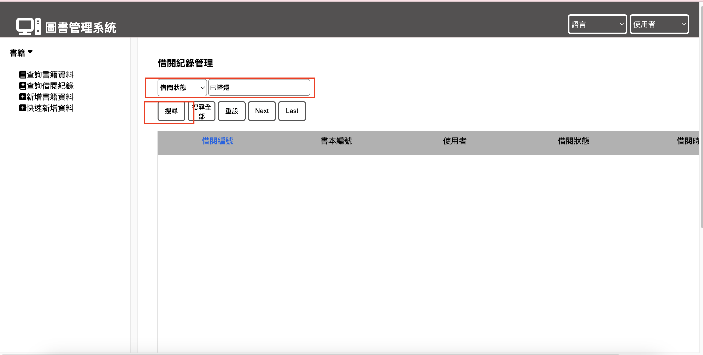

###### after

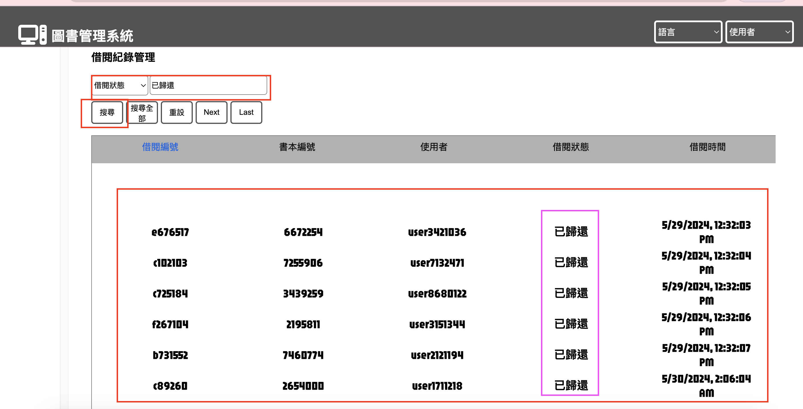

##### 查詢指定書籍編號的所有借閱紀錄
##### 說明:利用下方的api進行查詢 column = id(欄位) result = 實際id的數值 
```
app.get("/api/v3/borrowReocrd/:column/:result", async (req, res) => {
  try {
    const { column, result } = req.params;
    const { data } = await supabase
      .from("borrowrecord")
      .select("*")
      .eq(column, result);
    res.json(data);
  } catch (error) {
    console.log(error);
    res.status(500);
  }
});

```

###### before

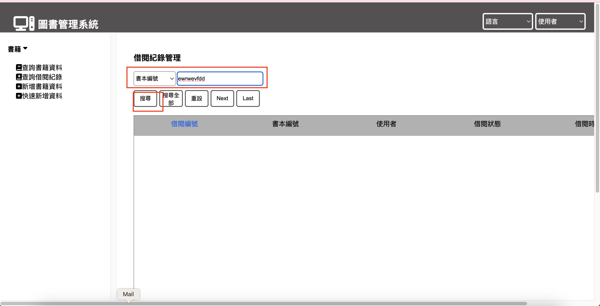

###### after

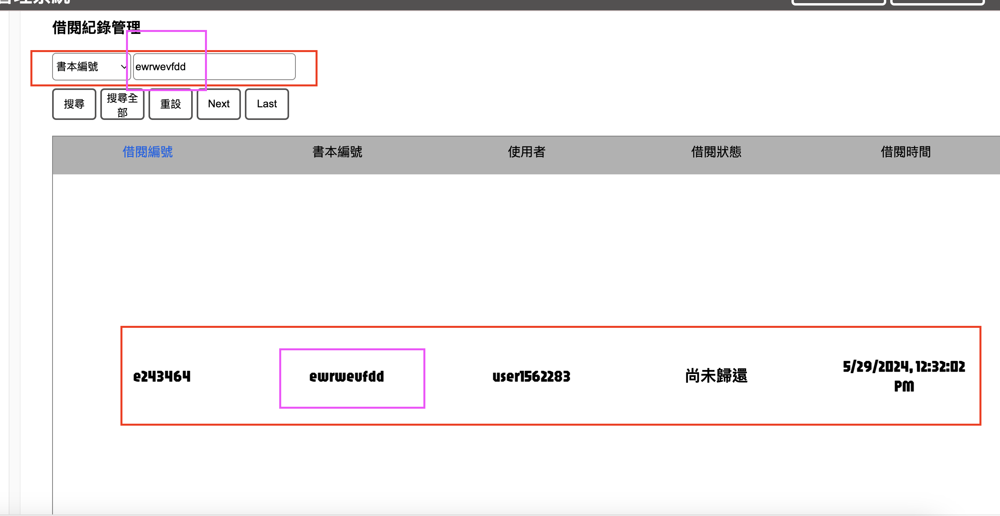

##### 查詢所有借閱紀錄
###### 撈出借閱紀錄表中的所有資料
```
app.get("/api/borrowRecord", async (req, res) => {
  try {
    let { data, error } = await supabase.from("borrowrecord").select("*");
    console.log("success!!");
    res.json(data);
  } catch (error) {
    res.status(400).send(error);
    console.log(error);
  }
});
```
###### before

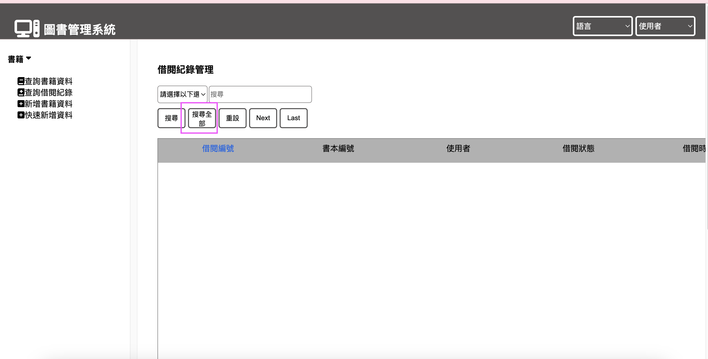

###### after

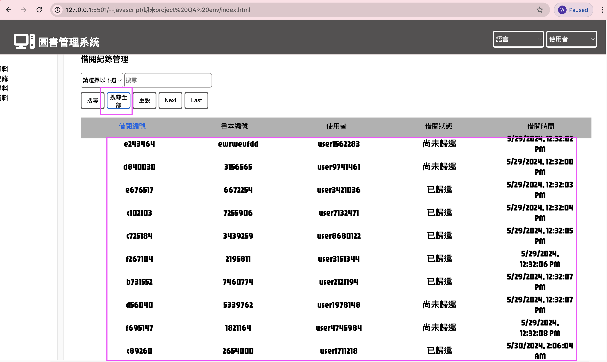

#### => 功能 2：新增

##### 手動新增資料:只會新增在booksdata
### 前端code:
#### 因為編輯資料與新增資料都是用同一個輸入框 只是發送的api不一樣 所以在按下create按鈕後 會先利用TITLE判斷是要新增還是編輯
#### 接者取得輸入框內的資料 如果輸入框內的值為空 就不會往下執行
#### 取得輸入框內的資料後 放在URL內 然後發起一個POST的請求

```
async function CreateInfo(title, data) {
  DisplayEditInput(title);
  const create_btn = document.querySelector(".create-btn");
  const close_btn = document.querySelector(".close-btn");
  const result_Id = document.querySelector("#book_id");
  const result_Name = document.querySelector("#book_name");
  const result_Author = document.querySelector("#book_author");
  const result_Class = document.querySelector("#book_class");

  console.log(create_btn);
  close_btn.addEventListener("click", () => {
    overlay.classList.add("hidden");
    create_container.classList.add("hidden");
  });
  create_btn.addEventListener("click", async () => {
    if (title === "新增資料") {
      if (
        result_Id.value === "" ||
        result_Name.value === "" ||
        result_Author.value === "" ||
        result_Class.value === ""
      ) {
        result_Id.style.border = "1px solid red";
        result_Name.style.border = "1px solid red";
        result_Author.style.border = "1px solid red";
        result_Class.style.border = "1px solid red";
      }
      const response = await fetch(
        `http://localhost:3000/api/post/book/${result_Id.value}/${
          result_Name.value
        }/${result_Author.value}/${encodeURI(result_Class.value)}`,
        { method: "POST" }
      );
      response.status !== 200 ? false : loading.classList.add("hidden"),
        overlay.classList.add("hidden"),
        create_container.classList.add("hidden");

      console.log(response);
    } else if (title === "編輯資料") {
      /** @type {Array.<string>} */
      let datalist = [];
      datalist.push(result_Id.value);
      datalist.push(result_Name.value);
      datalist.push(result_Author.value);
      datalist.push(result_Class.value);
      UpdateApi(data, datalist);
    }
  });
}


```
### 後端code
#### 說明:後端接收到請求 解析出URL內的參數 並且用supabase內的api 插入一筆資料
```
app.post(
  "/api/post/book/:book_id/:book_name/:author_name/:classification",
  async (req, res) => {
    try {
      const classification = decodeURI(req.params.classification);
      const { book_id, book_name, author_name } = req.params;

      const { data, error } = await supabase
        .from("booksdata")
        .insert([
          {
            book_id: book_id,
            book_name: book_name,
            author_name: author_name,
            classification: classification,
          },
        ])
        .select();
      res.send([
        {
          id: book_id,
          book_name: book_name,
          author_name: author_name,
          classification: classification,
        },
      ]);
    } catch (error) {
      console.log(error);
    }
  }
);


```

###### before

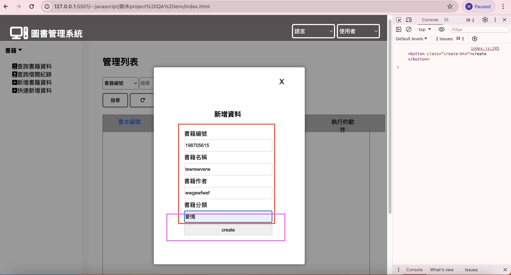

###### after

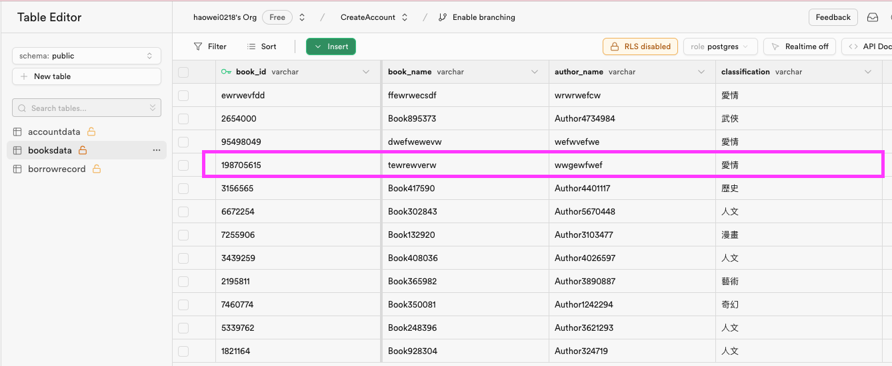

###### api response

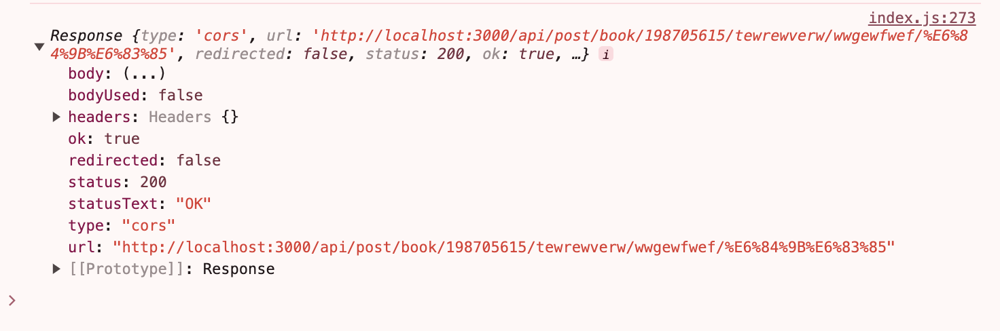

#### => 功能 3 : 刪除

##### 刪除指定資料
##### 前端:每筆資料都會產生一個刪除按鈕 該刪除按鈕的className = book_id所以每個按鈕都是唯一的
##### 抓到按鈕後 點擊會跳出一個彈窗詢問是否要刪除 點擊確認後才會真的對刪除的api發起delete請求
```
function DeleteApi(delete_column) {
  const close_btn = document.querySelector(".close_delete");
  const disable_btn = document.querySelector(".disable");
  const check_btn = document.querySelector(".check_btn");
  close_btn.addEventListener("click", () => {
    overlay.classList.add("hidden");
    PopUpDeleteWindow.classList.add("hidden");
  });
  disable_btn.addEventListener("click", async () => {
    overlay.classList.add("hidden");
    PopUpDeleteWindow.classList.add("hidden");
    await PerpageDisplayData(itempage, "http://localhost:3000/api/table");
  });
  check_btn.addEventListener("click", async () => {
    try {
      const get_borrow_response = await fetch(
        `http://localhost:3000/api/v2/borrowRecord/book_id=${delete_column}`
      );
      console.log(get_borrow_response);
      get_borrow_response.status === 200
        ? await fetch(
            `http://localhost:3000/api/delete/v1/borrowRecord/${delete_column}`,
            { method: "DELETE" }
          )
        : false;
      console.log("delete success");
      PopUpDeleteWindow.classList.add("hidden");
      overlay.classList.add("hidden");
      PerpageDisplayData(itempage, `http://localhost:3000/api/table`);
    } catch (error) {
      console.log(error);
    }
  });
}

```
##### 後端:因為兩張表有關連 所以要進行刪除要先刪除foreign key那張表的紀錄 再刪除primary key那張表的紀錄 因為有關聯的是id and book_id 所以用這兩個欄位刪除
```
app.delete("/api/delete/v1/borrowRecord/:borrowData", async (req, res) => {
  try {
    const { borrowData } = req.params;
    await supabase.from("borrowrecord").delete().eq("id", borrowData);
    await supabase.from("booksdata").delete().eq("book_id", borrowData);
    res.status(200).send("delete success!!");
  } catch (error) {
    res.status(500).json({ error });
  }
});


```

###### before
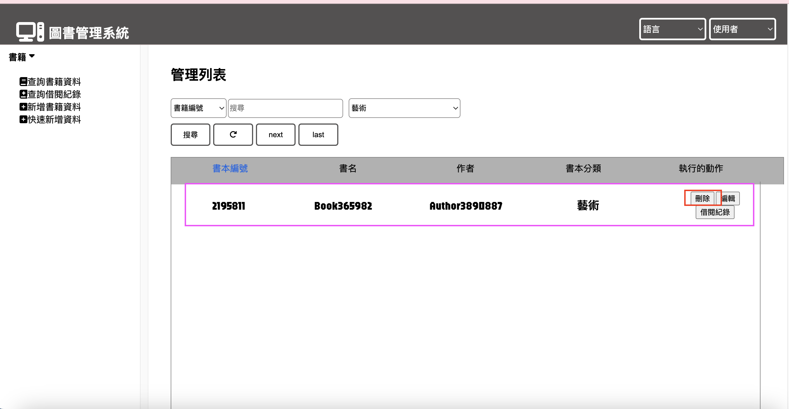
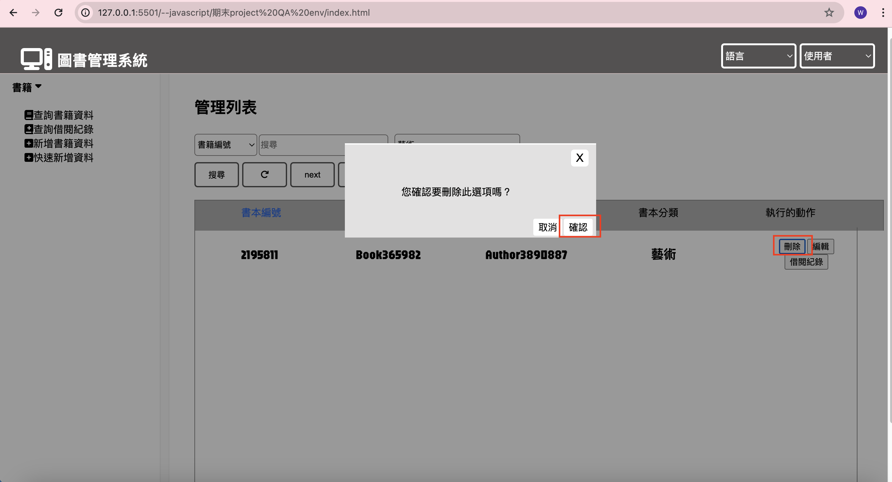

###### after

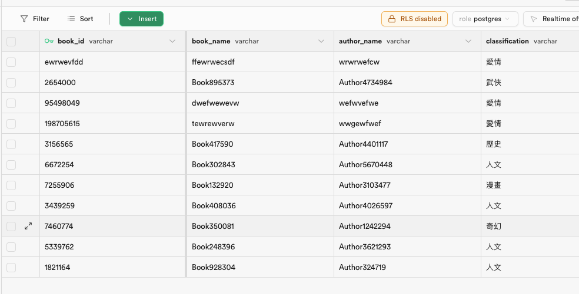

#### => 功能 4 : 編輯指定資料
##### 前端:抓到輸入框的資料 放在一個陣列裡面 並調用UpdateApi()  
#### 前端code createInfo function:
```
async function CreateInfo(title, data) {
  DisplayEditInput(title);
  const create_btn = document.querySelector(".create-btn");
  const close_btn = document.querySelector(".close-btn");
  const result_Id = document.querySelector("#book_id");
  const result_Name = document.querySelector("#book_name");
  const result_Author = document.querySelector("#book_author");
  const result_Class = document.querySelector("#book_class");

  console.log(create_btn);
  close_btn.addEventListener("click", () => {
    overlay.classList.add("hidden");
    create_container.classList.add("hidden");
  });
  create_btn.addEventListener("click", async () => {
    if (title === "新增資料") {
      if (
        result_Id.value === "" ||
        result_Name.value === "" ||
        result_Author.value === "" ||
        result_Class.value === ""
      ) {
        result_Id.style.border = "1px solid red";
        result_Name.style.border = "1px solid red";
        result_Author.style.border = "1px solid red";
        result_Class.style.border = "1px solid red";
      }
      const response = await fetch(
        `http://localhost:3000/api/post/book/${result_Id.value}/${
          result_Name.value
        }/${result_Author.value}/${encodeURI(result_Class.value)}`,
        { method: "POST" }
      );
      response.status !== 200 ? false : loading.classList.add("hidden"),
        overlay.classList.add("hidden"),
        create_container.classList.add("hidden");

      console.log(response);
    } else if (title === "編輯資料") {
      /** @type {Array.<string>} */
      let datalist = [];
      datalist.push(result_Id.value);
      datalist.push(result_Name.value);
      datalist.push(result_Author.value);
      datalist.push(result_Class.value);
      UpdateApi(data, datalist);
    }
  });
}
```
#### UpdateApi(data, datalist):接收一個陣列 該陣列用於更新資料庫內資料 先找到舊資料 然後將回傳回的資料循環一遍放在data_object物件內 接著對輸入值進行判斷 最後利用陣列索引的方式將值放入url內 然後PUT請求
```
async function UpdateApi(filterdata, UpdateArray = Array) {
  try {
    const response = await FetchApi(
      `http://localhost:3000/api/book_id/${filterdata}`,
      "GET"
    );

    for (const item of response) {
      /**
       * @typedef {Object} BookData
       * @property {string} id
       * @property {string} bookName
       * @property {string} author
       * @property {string} classification
       */
      /**@type {BookData} */
      const data_object = {
        id: item.book_id,
        bookName: item.book_name,
        author: item.author_name,
        classification: item.classification,
      };
      console.log(data_object);

      /**檢查輸入匡內的值是否為空 */
      UpdateArray[0] !== ""
        ? (data_object.id = UpdateArray[0])
        : console.log("輸入值為空");
      UpdateArray[1] !== ""
        ? (data_object.bookName = UpdateArray[1])
        : console.log("輸入值為空");
      UpdateArray[2] !== ""
        ? (data_object.author = UpdateArray[2])
        : console.log("輸入值為空");
      UpdateArray[3] !== ""
        ? (data_object.classification = UpdateArray[3])
        : console.log("輸入值為空");
      console.log(data_object);
    }
    create_container.classList.add("hidden");
    overlay.classList.add("hidden");
    const book_response = await fetch(
      `http://localhost:3000/api/update/${filterdata}/${UpdateArray[0]}/${
        UpdateArray[1]
      }/${UpdateArray[2]}/${encodeURI(UpdateArray[3])}`,
      { method: "PUT" }
    );
    const UpdateApiData = await FetchApi(
      `http://localhost:3000/api/book_id/${UpdateArray[0]}`,
      "GET"
    );
    console.log(UpdateApiData);
    DisplayContent(UpdateApiData);
  } catch (error) {
    console.log(error);
  }
}

```

#### 後端code:關聯表更新：在primary key表先插入一筆新的資料同步foreign key的資料 最後刪除舊資料 
```
app.put(
  "/api/update/:filterId/:id/:bookName/:author/:Updateclass",
  async (req, res) => {
    try {
      const { id, bookName, author, filterId } = req.params;
      const updateclass = decodeURI(req.params.Updateclass);
      await supabase.from("booksdata").insert([
        {
          book_id: id,
          book_name: bookName,
          author_name: author,
          classification: updateclass,
        },
      ]);
      await supabase.from("borrowrecord").update({ id: id }).eq("id", filterId);
      await supabase.from("booksdata").delete().eq("book_id", filterId);
      let { data } = await supabase
        .from("booksdata")
        .select("*")
        .eq("book_id", id);
      console.log({
        book_id: id,
        book_name: bookName,
        author_name: author,
        classification: updateclass,
      });
      res.status(204).send({ data });
    } catch (error) {
      res.status(500).send(error);
    }
  }
);


```
###### before

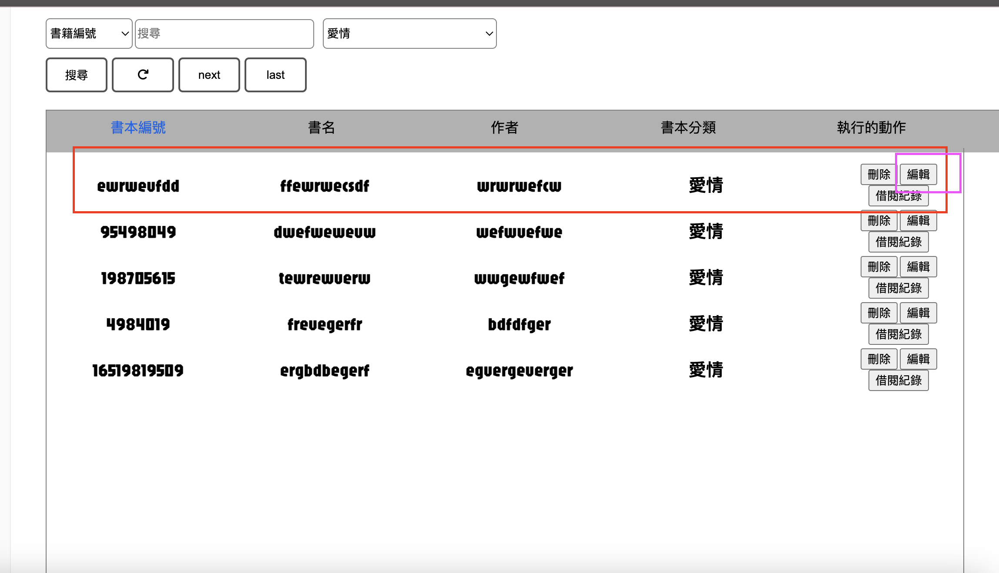
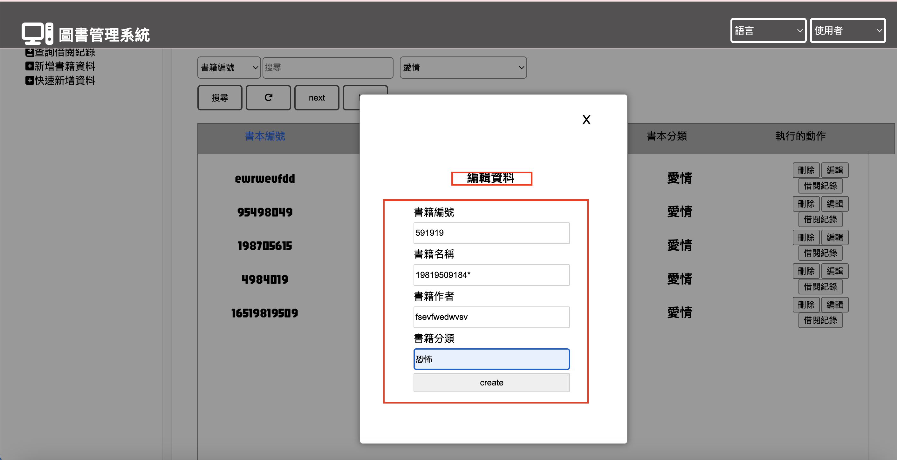
###### after

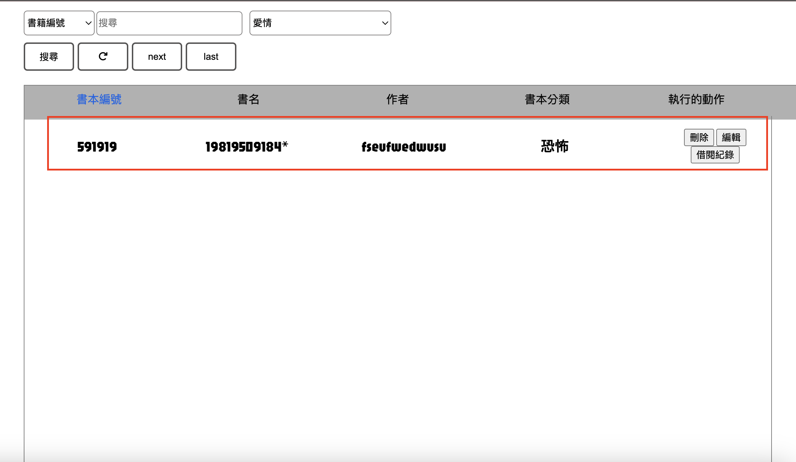
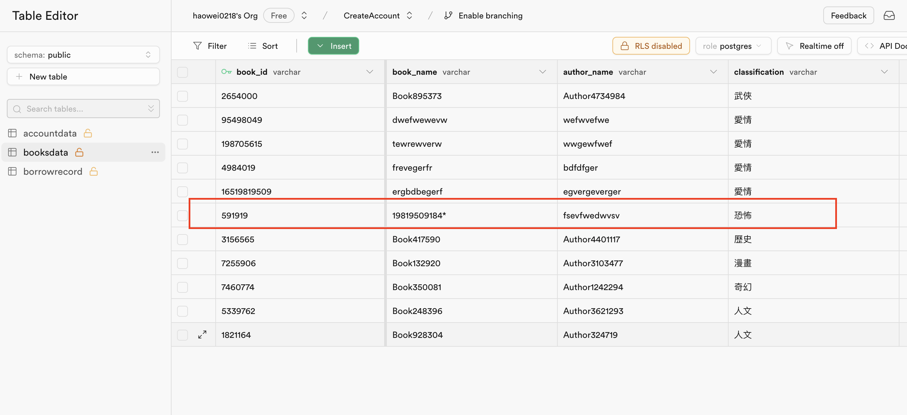
---

### 解決問題說明

#### => 問題 1 : 分頁功能製作,在系統內有個功能會撈出所有借閱紀錄,為了讓資料不超出表格 所以需要一個分頁功能限制每次呈現在表格內的資料數量

##### => 解決方法:後端撈出所有資料後,前端透過slice方法處理

###### 前端

###### html css => 設計一個上一頁/下一頁按紐

###### js => 點擊下一頁: 變數page + 1 並且調用以下function, data = fetchApi所回傳的資料,一個JSON物件

###### 點擊上一頁: 變數page - 1 並且調用以下function, data = fetchApi所回傳的資料,一個JSON物件

```
async function PerpageDisplayData(Page, data) {
  try {
    const limit = 10;
    const start = (Page - 1) * limit;
    const end = start * limit;
    let response_length = Object.values(data).length;
    let new_response = Object.values(data);

    response_length > limit
      ? DisplayContent(new_response.slice(start, end))
      : DisplayContent(new_response),
      data_status.classList.add("hidden");
    new_response.length === 0 ? data_status.classList.remove("hidden") : false;
  } catch (error) {
    alert(error);
  }
}
```

###### 後端

###### node.js => 定義一個路由,如果前端對這個api發送get請求,此api會從supabase撈出所有資料並回傳

```
app.get("/api/borrowRecord", async (req, res) => {
  try {
    let { data, error } = await supabase.from("borrowrecord").select("*");
    console.log("success!!");
    res.json(data);
  } catch (error) {
    res.status(400).send(error);
    console.log(error);
  }
});
```

#### => 問題 2: 兩張表有關聯,booksdata表的book_id欄位是primary key同時又是borrowrecord的foreign key 如何進行CRUD

##### 解決方法

###### 新增一筆資料: 先新增priamry key那張表數據 再新增foreign key那張表數據

###### 刪除一筆資料: 先刪除foreign key那張表的數據 再刪除parmary Key那張表的數據

```
app.delete("/api/delete/v1/borrowRecord/:borrowData", async (req, res) => {
  try {
    const { borrowData } = req.params;
    await supabase.from("borrowrecord").delete().eq("id", borrowData);
    await supabase.from("booksdata").delete().eq("book_id", borrowData);
    res.status(200).send("delete success!!");
  } catch (error) {
    res.status(500).json({ error });
  }
});
```

###### 編輯一筆資料: 先新增一筆資料再priamry key那張表,更改foreign key內的資料, 最後刪除舊的資料

```
app.put(
  "/api/update/:filterId/:id/:bookName/:author/:Updateclass",
  async (req, res) => {
    try {
      const { id, bookName, author, filterId } = req.params;
      const updateclass = decodeURI(req.params.Updateclass);
      await supabase.from("booksdata").insert([{
            book_id: id,
            book_name: bookName,
            author_name: author,
            classification: updateclass,
          },
        ]);
      await supabase.from("borrowrecord").update({ id: id }).eq("id", filterId);
      await supabase.from("booksdata").delete().eq("book_id", filterId);
      let { data } = await supabase
        .from("booksdata")
        .select("*")
        .eq("id", filterId);
      res.status(204).send({ data });
    } catch (error) {
      res.status(500).send(error);
    }
  }
);

```

#### => 問題 3

#### => 問題 4

#### => 問題 5

---

### 學習甘苦談

#### => 1.

#### => 2.

#### => 3.

#### => 4.

#### => 5.
